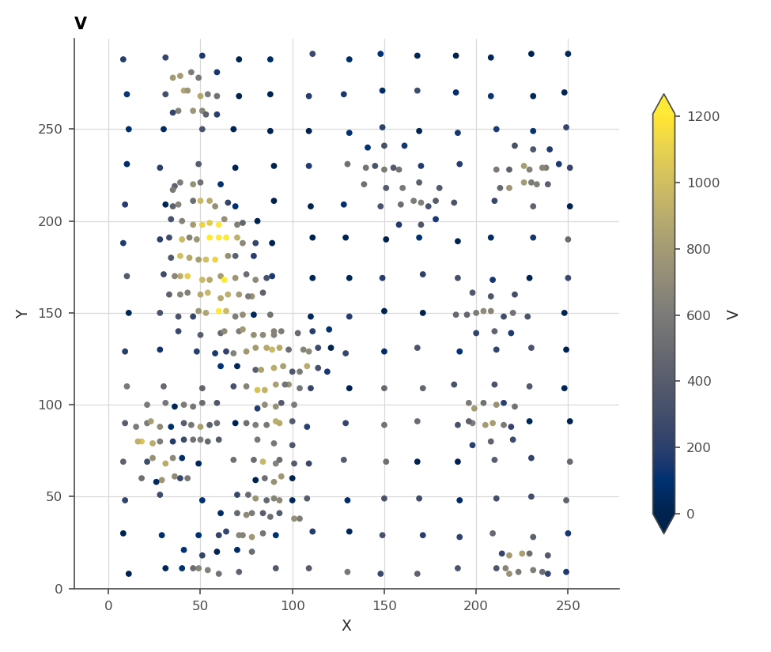
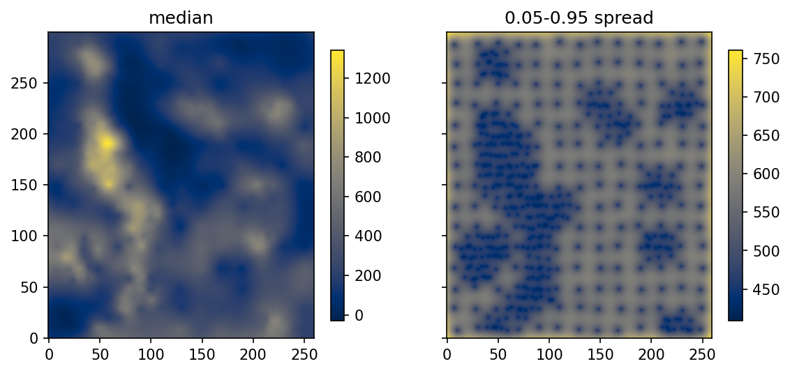

# 2. The GP is kriging

The Gaussian process is not a rival to kriging, and learning it is not a
change of field. It is a re-derivation of the kriging model from a Bayesian
point of view. Every quantity a geostatistician already trusts (the
weights, the estimation variance, the variogram) reappears here under
another name, computed by the same linear algebra. What changes is what
the pieces *mean*, and that change of reading is what the rest of the
manual builds on. Once the variogram is a prior and the kriging system is
a conditioning step, replacing the Gaussian assumption, stacking models or
attaching a categorical variable all become natural moves rather than new
theories.

Throughout the manual, lowercase letters are scalars ($z$, $r$), bold
lowercase letters are vectors ($\mathbf{x}$, $\mathbf{z}$), and bold
uppercase letters are matrices ($\mathbf{K}$). $\mathcal{N}$ is the Gaussian
distribution.

## 2.1 Simple kriging, restated

Take $N$ samples $z_1, \dots, z_N$ at locations $\mathbf{x}_1, \dots,
\mathbf{x}_N$, a known stationary mean $m$, and a covariance function
$k(\mathbf{x}, \mathbf{x}')$ fitted to the data. Simple kriging estimates
the value at a new location as a weighted average of the samples, with the
weights $\boldsymbol{\lambda}$ solving one linear system per target
location:

$$
\left[\mathbf{K}_{NN} + \sigma_0^2 \mathbf{I}\right] \boldsymbol{\lambda}
= \mathbf{k}_0,
$$

where $\mathbf{K}_{NN}$ holds the covariances between samples,
$\mathbf{k}_0$ the covariances between the samples and the target, and
$\sigma_0^2$ is the nugget. The estimate is
$\hat{z}_0 = m + \boldsymbol{\lambda}^T (\mathbf{z} - m)$, and the
estimation variance follows from the same quantities.

Now the Bayesian derivation of the same numbers. Model the ground as a
random function $f(\mathbf{x})$ with a Gaussian process prior, meaning
only this: any set of locations, read jointly, is multivariate Gaussian,
with mean $m$ and covariances given by $k$. Model each sample as that
function plus measurement noise, $z_i = f(\mathbf{x}_i) + \epsilon_i$ with
$\epsilon_i \sim \mathcal{N}(0, \sigma_0^2)$. Conditioning the prior on the
$N$ observed values gives a posterior distribution at any set of new
locations, and it is Gaussian with

$$
\boldsymbol{\mu}_G = \mathbf{K}_{GN}
\left[\mathbf{K}_{NN} + \sigma_0^2 \mathbf{I}\right]^{-1}
(\mathbf{z}_N - \mathbf{m}_N) + \mathbf{m}_G
$$

$$
\boldsymbol{\Sigma}_G = \mathbf{K}_{GG} - \mathbf{K}_{GN}
\left[\mathbf{K}_{NN} + \sigma_0^2 \mathbf{I}\right]^{-1}
\mathbf{K}_{NG}.
$$

The posterior mean **is** the simple kriging estimate, from the same
system and the same weights, location by location, and the diagonal of the
posterior covariance is the simple kriging variance. Nothing was gained
yet, and nothing was lost. The GP at this point is kriging with its
assumptions written out as a probability model instead of left implicit in
the estimator.

Three readings change, though, and each buys something later:

- **The variogram is a prior.** It states what the field is believed to do
  before the data speak, so fitting it becomes a statistical estimation
  problem with a likelihood rather than a curve-fitting exercise on the
  experimental variogram (§2.3).
- **The answer is a distribution.** The kriging variance stops being an
  abstract "estimation variance" and becomes the width of an actual
  predictive distribution, something that can be simulated from, warped,
  and checked against held-out data (chapter 13).
- **The noise is a model component.** The nugget $\sigma_0^2$ sits in the
  *likelihood*, the measurement model, and not in the covariance of the
  ground. The posterior above filters it, so predictions are of $f$, the
  ground, with the scatter of the assays averaged out. Kriging with
  measurement error makes the same move. Here it is the default, and
  chapter 4 builds a whole doctrine on the distinction.

> **In the code.** `geoml.models.GP` is this model, closed form and
> single-variable, the legacy entry point kept for exactly this
> correspondence. Modern work goes through `geoml.models.VGPNetwork`
> (chapter 3), which contains the GP as its simplest case. The nugget is
> the `noise` parameter of `geoml.likelihood.Gaussian`, and the covariance
> function is assembled in §2.2's box.

## 2.2 Covariance functions are variogram models

Under stationarity the two spellings carry the same information. With sill
$\sigma_1^2$,

$$
\gamma(h) = \sigma_0^2 + \sigma_1^2 - k(h) \quad (h > 0),
$$

so the familiar variogram models are covariance functions read upside down.
geoML writes them on a **normalized distance** $d$, scaled so that the
`ranges` parameter is the *practical* range, the distance where the
structure has effectively vanished. That is how a fitted variogram is read
in practice:

| model | covariance | variogram behaviour |
|---|---|---|
| spherical | $\sigma_1^2 (1 - 1.5d + 0.5d^3)$ for $d \le 1$, else $0$ | reaches the sill exactly at the range |
| exponential | $\sigma_1^2 \exp(-3d)$ | 95% of the sill at the range |
| Gaussian | $\sigma_1^2 \exp(-3d^2)$ | parabolic at the origin: very smooth fields |

The choice among them is the same judgement it always was. The behaviour
at the origin is the model's opinion about short-range continuity, and the
Gaussian model's extreme smoothness is as double-edged here as in kriging.
Nested structures are sums of covariances, as before.

Anisotropy enters through the distance:

$$
d = \sqrt{(\mathbf{x} - \mathbf{x}')^T \mathbf{A}^T \mathbf{A}
(\mathbf{x} - \mathbf{x}')},
$$

with $\mathbf{A}$ encoding the search-ellipsoid geometry: ranges along
principal directions, and the rotation placing them in space. In geoML the
matrix is a *spatial transform* object handed to the covariance, which is a
more consequential design than it looks. Transforms chain, so a fault, a
projection or a learned deformation composes with the ellipsoid instead of
requiring a new kernel. Chapters 3 and 5 use this freely.

> **In the code.** `geoml.kernels.Covariance(kernel=..., transform=...)`
> assembles the pieces: `kernels.Spherical()`, `kernels.Exponential()`,
> `kernels.Gaussian()` for the function, and `geoml.transform.Isotropic`,
> `Anisotropy2D`, `Anisotropy3D` for the ellipsoid, with
> `ChainedTransform` to compose them. The ranges and angles are trainable
> parameters, which is the subject of the next section.

## 2.3 Fitting: maximum likelihood instead of the eye

The traditional workflow fits the variogram to the experimental one. That
step is subjective, sensitive to binning and to the practitioner, and the
experimental variogram's pointwise behaviour is treacherous enough that
the risks were documented long ago (Cressie, 1985). The probability-model
reading replaces it: the variogram parameters (ranges, sill, nugget,
anisotropy angles) are chosen to maximize the likelihood of the data under
the model. Variogram modelling *is* GP training with a Gaussian
likelihood, with one objective, no bins, gradients available, and every
parameter including the rotation angles estimated jointly.

The price is printed on the same line. The likelihood involves
$\left[\mathbf{K}_{NN} + \sigma_0^2\mathbf{I}\right]^{-1}$ and its
determinant, which cost $\mathcal{O}(N^3)$: fine at hundreds of samples,
heavy at ten thousand assays, impossible at a hundred thousand. Kriging's
classical answer is the search neighbourhood, solving small local systems
and accepting the artefacts (discontinuous maps, negative weights, a
variance that ignores most of the data). The variational answer keeps one
global model and makes it *sparse* instead. That is chapter 3, and it is
the reason this package exists.

## 2.4 Walker Lake, the short way

The bundled Walker Lake set runs the whole correspondence in a few lines.
It holds 470 samples of the classic `V` variable, a second variable `U`,
and the prediction grid. Printing the container's tree is the habit worth
forming: every variable, every column, and what is filled in so far.

```python
import os

import geoml

os.makedirs("figures", exist_ok=True)
geoml.set_seed(1234)

walker, walker_grid = geoml.datasets.walker()
print(walker.tree())
```

```
PointData - 470 locations
|-- V                          ContinuousVariable
|   |-- measurements           float64
|   |-- latent_mean            empty
|   |-- latent_variance        empty
|   |-- prediction             empty
|   |-- dispersion             empty
|   `-- noise_variance         empty
`-- U                          ContinuousVariable
    |-- measurements           float64
    ...
```

The empty columns are the ones a prediction fills. Now look at the
sampling:

```python
figure = geoml.plots.Explorer(walker, continuous="V").scene(clip=[0, 0.99])
figure.savefig("figures/02-walker-samples.png", dpi=150)
```



The sampling is already the story half told: dense lines and sparse gaps,
so any validation that ignores the geometry will lie (chapter 13). The
model is three objects. The `ZScore` warping standardizes the variable,
which is all the plain model needs. Chapter 4 does far more with warpings.

```python
covariance = geoml.kernels.Covariance(
    kernel=geoml.kernels.Spherical(),
    transform=geoml.transform.Isotropic(100.0))

model = geoml.models.GP(
    data=walker,
    variable="V",
    covariance=covariance,
    warping=geoml.warping.ZScore(1),
    options=geoml.models.GPOptions(verbose=False))

model.train(20)
print(model)
```

Training moved the range, sill and nugget to their maximum-likelihood
values. No experimental variogram was drawn, and printing the model shows
where the parameters landed, each with the bounds it was allowed to move
in. This printout is the fitted variogram, and reading it is the same
habit as reading a variogram model before kriging with it.

Prediction fills the grid with the posterior: the kriging estimate, and
simulated realizations to cut intervals from.

```python
import matplotlib.pyplot as plt

model.predict(walker_grid, n_sim=20)

walker_grid.get("V").reset_quantiles([0.05, 0.5, 0.95])
median = walker_grid.get("V/quantiles/0.5").as_image()
spread = walker_grid.get("V/quantiles/0.95").as_image() \
    - walker_grid.get("V/quantiles/0.05").as_image()

figure, axes = plt.subplots(1, 2, figsize=(9, 4.2), sharey=True)

for ax, image, title in zip(axes, [median, spread],
                            ["median", "0.05-0.95 spread"]):
    drawn = ax.imshow(image, origin="lower", cmap="cividis")
    figure.colorbar(drawn, ax=ax, shrink=0.8)
    ax.set_title(title)

figure.savefig("figures/02-walker-posterior.png", dpi=150,
               bbox_inches="tight")
```



The median map is kriging's map. The spread beside it is the part kriging
computed and mostly discarded, widest exactly where the samples thin out.
Whether that band can be *believed* is a question with machinery of its
own, and chapter 13 is where it lives.

One property of this model deserves to be said out loud before anyone
maps a grade with it:

```python
import numpy as np

print("lowest simulated value:",
      round(float(np.min(walker_grid.values("V/quantiles/0.05"))), 1))
```

The number is negative. `V` is a positive variable, and nothing in the
construction knows that. The latent field is Gaussian on the whole real
line, and `ZScore` is a linear map, so the back-transform can return any
value at all. Part of the predictive distribution therefore sits below
zero wherever the model is unsure near low grades, which shows up in the
lower quantiles first and in the mean of a skewed variable soon after.
Kriging has the same defect and the same excuse. Chapter 4 fixes it
properly, by putting a positivity warping between the field and the
variable so that no realization can come back negative.

## Further reading

Rasmussen & Williams (2006) is the GP standard text, §2 for this chapter's
material and §5.4.2 for the closed-form cross-validation the variational
model will have to earn differently. Chilès & Delfiner (2012) and
Goovaerts (1997) carry the kriging side. The correspondence, in the
package's own notation, is §2 of the 2022 regression paper.

## References

Chilès, J.-P., & Delfiner, P. (2012). *Geostatistics: Modeling Spatial
Uncertainty* (2nd ed.). Wiley.

Cressie, N. (1985). Fitting variogram models by weighted least squares.
*Mathematical Geology*, 17(5), 563–586.

Gonçalves, Í. G. *et al.* (2022). Learning spatial patterns with
variational Gaussian processes: regression. *Computers & Geosciences*.
<https://doi.org/10.1016/j.cageo.2022.105056>

Goovaerts, P. (1997). *Geostatistics for Natural Resources Evaluation*.
Oxford University Press.

Rasmussen, C. E., & Williams, C. K. I. (2006). *Gaussian Processes for
Machine Learning*. MIT Press.
