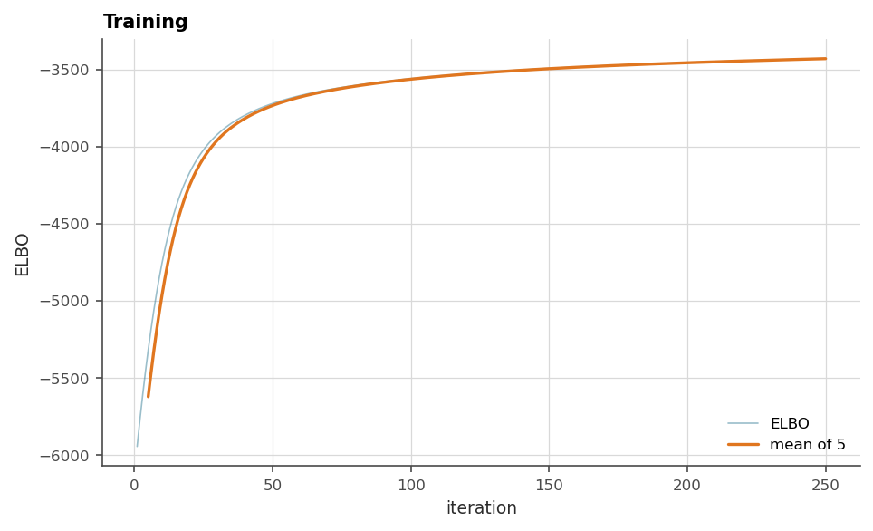
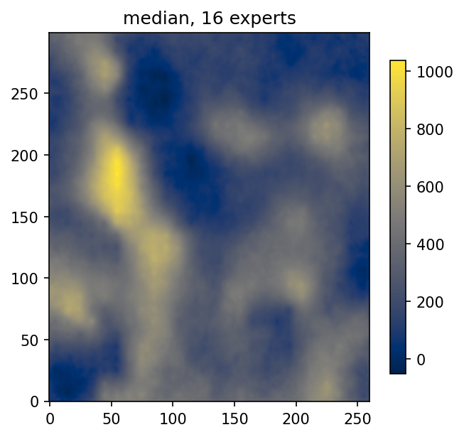

# 3. Inducing points and the ELBO

Chapter 2 ended at the wall. The exact model costs $\mathcal{O}(N^3)$, and
kriging's classical way around it, the search neighbourhood, buys speed
with artefacts, because every target location gets a different model and
none of them sees the whole campaign. The variational answer keeps **one
global model** and makes it sparse instead. This chapter is the package's
engine room, and every model in the rest of the manual is built from the
pieces introduced here.

## 3.1 Pseudo-data: the inducing points

Pick $U \ll N$ locations $\mathbf{T}$, the *inducing points*, and let the
model carry a distribution over the field's values $\mathbf{u}$ at those
locations only:

$$
q(\mathbf{u}) = \mathcal{N}(\mathbf{u};\, \mathbf{m}, \mathbf{S}).
$$

Everything else is read *through* them. The prediction at any location is
the prior conditioned on $\mathbf{u}$, averaged over $q$. The intuition is
entirely geostatistical: the inducing values are a **composite of the
information**, a small, well-placed campaign standing in for the full
database, with $\mathbf{m}$ its estimates and $\mathbf{S}$ how sure it is.
The heavy algebra now runs on $U \times U$ matrices, the cost falls to
$\mathcal{O}(NU^2)$, and $N$ only enters linearly.

The parameters of $q$ are not solved for in closed form. They are
*fitted*, by maximizing the **evidence lower bound (ELBO)**:

$$
\log p(\mathbf{z}) \;\ge\; \sum_{n=1}^{N}
\mathbb{E}_{q(f_n)}\left[\log p(z_n \mid f_n)\right]
\;-\; \mathrm{KL}\left[q(\mathbf{u}) \,\|\, p(\mathbf{u})\right].
$$

That expression is worth walking through slowly, because every training
run in this manual is a climb up it.

**Two different quantities live at each sample location.** $f_n$ is the
value of the *latent field* at $\mathbf{x}_n$, the ground itself, which
nobody ever observes. $z_n$ is the *measurement*, the number in the assay
file. They are related by the likelihood $p(z_n \mid f_n)$, which in the
simplest case says $z_n = f_n + \epsilon_n$ with $\epsilon_n$ the nugget
of chapter 2. Keeping the two apart is not pedantry, and chapter 4 turns
it into a working doctrine, but it already earns its keep here: the model
is asked to explain the *measurements*, while what it carries a
distribution over is the *ground*.

**The first term is a weighted average, not an evaluation.** The model
does not know $f_n$. What it knows is $q(f_n)$, a Gaussian marginal got by
conditioning the prior on $\mathbf{u}$ and averaging over $q(\mathbf{u})$.
So the fit term cannot be "the likelihood at the estimate". It is the
likelihood *averaged over every value the field might plausibly take
there*, each weighted by how plausible the model currently finds it:

$$
\mathbb{E}_{q(f_n)}\left[\log p(z_n \mid f_n)\right] =
\int \log p(z_n \mid f)\; q(f_n = f)\; \mathrm{d}f .
$$

This is why the model is honest about its own uncertainty rather than
merely reporting it. A location where $q(f_n)$ is wide contributes a
*smeared* likelihood, and smearing costs. Being uncertain is penalised
exactly where the data could have pinned the field down, so widening the
posterior to dodge a residual is not free. It also means the term is not
generally available in closed form. For a Gaussian likelihood with a
linear warping it is, and otherwise geoML computes it by quadrature or by
sampling, which is where `n_sim` and the quadrature node counts of
chapter 4 come from.

**The second term is the restraint.** $\mathrm{KL}[q(\mathbf{u}) \|
p(\mathbf{u})]$ measures how far the fitted $q$ has moved from the prior,
which is the covariance model of chapter 2. It pulls the other way from
the fit term, a built-in penalty against fitting noise, playing the role
the nugget and the modeller's restraint play in classical practice.
The difference is that here it is part of one objective rather than a
convention.

Everything trainable climbs this single number by gradient ascent (Adam):
variational parameters, ranges, sill, noise, and the warping.

Two technical choices are worth knowing by name because they appear in
every saved model. The variational mean is *whitened*
($\boldsymbol{\alpha} = \mathbf{L}^{-1}\mathbf{m}$, with
$\mathbf{K}_{uu} = \mathbf{L}\mathbf{L}^T$), which decouples it from the
kernel parameters during optimization. The covariance uses the
Opper–Archambeau form, which adds only $2U$ parameters and guarantees the
posterior variance never exceeds the prior's. Titsias (2009) and Hensman
et al. (2013, 2015) are the source papers.

> **In the code.** The pair `geoml.latent.BasicInput` (the inducing points
> and the spatial transform at the door) and `geoml.latent.BasicGP` (the
> kernel and the variational state) is the minimal network.
> `geoml.models.VGPNetwork` owns the ELBO, `train_full` and `train_svi`.
> The whitened mean and the variance parameters are `alpha_white_*` and
> `delta_*` on each node, which chapter 13 re-initializes to make a fold
> model forget.

## 3.2 Feeding it: full batch or stochastic

The ELBO is a sum over samples, so a minibatch of size $B$ estimates it
after rescaling by $N/B$. That is stochastic variational inference.
`train_full` uses everything at each step and is the right call up to a
few thousand samples. `train_svi` cycles reproducible random batches and
is how 18 000 assays train comfortably.

The curve to watch is the same for both. The ELBO trace is noisy *by
construction*, since the expectation above is estimated, so read its
running mean: flat means settled, still climbing means keep going.
Stopping early is a quiet source of bad maps, and it is cheap to avoid.

## 3.3 Placing them, and how many

Where the inducing points go is a modelling decision the package makes
easy and deliberate:

- `inducing.from_kmeans(data, n)` puts them where the data is, which suits
  drillhole geometry: dense where the holes are dense.
- `inducing.from_grid(data, step)` covers a region evenly, for when the
  prediction area matters more than the sampling.

Their *positions are then fixed*. That is a design decision rather than a
limitation. Trainable positions were tested and rejected, because points
wander away from the region of interest and get stuck, and coverage is
worth more than the marginal likelihood gain. What is trainable is
everything the points carry.

How many is the model's main capacity knob, and the reading is the
variogram's. A **smooth field is summarized by few**, one or two hundred,
while a short-range, high-nugget field needs many to have anything local
to say. Too few shows up as an over-smoothed map that misses the highs.

Too many *can* cost more than time. On the Jura data, a stationary model
with a Gaussian likelihood went from 0.96 to 1.13 times the data's own
standard deviation on held-out sites when its inducing set merely doubled,
from 81 points to 169 for 259 samples: the difference between a model worth
having and one no better than quoting the average. The extra points are
extra capacity, and the range that would have to grow to keep the field
smooth is a plain point estimate the objective never charges for, so the
field roughens until the model interpolates its own samples. The
variational state pays a KL penalty; the range does not.

But that ceiling belongs to that model, not to the method. Chapter 16
rebuilds the same dataset with a heavy-tailed likelihood and a walked,
non-stationary input, and its held-out score is *flat* from 259 inducing
points to 1220. That is nearly five times as many, five and a half times
the training, and no measurable change. What a model can absorb depends on
what its structure does with the capacity.

So the count is a knob with no safe default, and there is only one way to
set it: measure on data the model has not seen, for the configuration you
actually intend to use. Both case studies do exactly that, and show their
tables.

## 3.4 Experts: many small models, one answer

Past a few hundred inducing points the $U^3$ work inside the model starts
to bite, and the answer is the geostatistical instinct again: local
models. The inducing set is split into overlapping **experts**, each a
small set responsible for its region, combined by precision weighting so
that no seam shows where one hands over to the next.

- `inducing.grid_experts(data, step, block=4)` lays the experts out as
  overlapping blocks of a lattice. Every expert holds the same number of
  points, which keeps the model's internal state rectangular.
- `inducing.experts(from_kmeans(data, 1500), 12)` is the unordered
  version: clustered experts that follow the data, each borrowing a share
  of its neighbours' points.

With many experts, one option matters.
`GPOptions(expert_propagation="independent")` lets each expert speak for
its own inducing set alone, instead of all experts cross-predicting each
other (`"consensus"`, the default). Measured on this package, training
runs 1.6× faster at 5 experts and 6.3× at 40, prediction up to 8×, with
quality within a few percent either way. Past roughly ten experts the
consensus is paying a quadratic bill for a cosmetic agreement.

## 3.5 Walker Lake, sparse

Now chapter 2's model rebuilt the modern way. The inducing points are laid
on a 10-unit lattice covering the *prediction grid* rather than the
samples, because the model has to say something everywhere the grid asks,
including the gaps between the sampled lines. `grid_experts` cuts that
lattice into blocks and returns one set per expert.

```python
import os

import geoml

os.makedirs("figures", exist_ok=True)
geoml.set_seed(1234)

walker, walker_grid = geoml.datasets.walker()

# one node every 10 units over the grid's extent, cut into blocks of
# 8 x 8 nodes; each expert also takes one node of margin all around, so
# neighbouring experts overlap and their answers blend without a seam
experts = geoml.data.inducing.grid_experts(walker_grid, 10.0, block=8)
print(len(experts), "experts of", experts[0].n_data, "inducing points")

root = geoml.latent.BasicInput(
    experts,
    transform=geoml.transform.Isotropic(50))

gp = geoml.latent.BasicGP(
    root,
    size=1,
    kernel=geoml.kernels.Spherical())

model = geoml.models.VGPNetwork(
    walker, "V",
    geoml.likelihood.Gaussian(geoml.warping.ZScore(1)),
    gp,
    options=geoml.models.GPOptions(verbose=False))

model.train_full(max_iter=250)

figure = geoml.plots.Explorer(walker, continuous="V",
                              model=model).training_curve()
figure.savefig("figures/03-training-curve.png", dpi=150,
               bbox_inches="tight")
```



```python
import matplotlib.pyplot as plt

model.predict(walker_grid, n_sim=20)
walker_grid.get("V").reset_quantiles([0.5])

figure, axes = plt.subplots(figsize=(5, 4.5))

drawn = axes.imshow(walker_grid.get("V/quantiles/0.5").as_image(),
                    origin="lower", cmap="cividis")
figure.colorbar(drawn, ax=axes, shrink=0.85)
axes.set_title("median, %d experts" % len(experts))

figure.savefig("figures/03-walker-sparse.png", dpi=150,
               bbox_inches="tight")
```



This is chapter 2's map. The same highs in the same places, the same lows
between them, and the same defect: nothing prevents a negative grade,
because the model is still a Gaussian field behind a linear warping. The
peaks are a little flatter, since the inducing points do not sit on the
samples and a lattice at 10 units cannot resolve a spike narrower than
that. Beyond it, the sparse construction did not change the answer, which
is the point being made here. It changed what the model is *able* to
become.

Nothing was gained in speed on 470 samples, and nothing should have been.
What the inducing points buy is room. Everything the following chapters
add (a trainable warping that keeps grades positive, a categorical
variable sharing the same network, a second layer that bends space, a
block model refined where the cut-off is undecided) rides on a model whose
cost no longer grows with the cube of the sample count. On this dataset
that is a promise. On a real campaign it is the difference between a model
and no model.

## Further reading

Titsias (2009) for the variational inducing-point construction; Hensman
et al. (2013) for stochastic variational inference and (2015) for
non-Gaussian likelihoods. §2 of the 2022 regression paper carries this
material in the package's own notation, and the 2026 scalable-VGP paper
covers the experts at deposit scale.

## References

Gonçalves, Í. G. *et al.* (2022). Learning spatial patterns with
variational Gaussian processes: regression. *Computers & Geosciences*.
<https://doi.org/10.1016/j.cageo.2022.105056>

Gonçalves, Í. G. *et al.* (2026). Scalable variational Gaussian process
framework for implicit geological modelling and compositional grade
interpolation. *Artificial Intelligence in Geosciences*.
<https://doi.org/10.1016/j.aiig.2026.100218>

Hensman, J., Fusi, N., & Lawrence, N. D. (2013). Gaussian processes for
big data. *Proceedings of the 29th Conference on Uncertainty in Artificial
Intelligence (UAI)*, 282–290.

Hensman, J., Matthews, A. G. de G., & Ghahramani, Z. (2015). Scalable
variational Gaussian process classification. *Proceedings of the 18th
International Conference on Artificial Intelligence and Statistics
(AISTATS)*, 351–360.

Opper, M., & Archambeau, C. (2009). The variational Gaussian approximation
revisited. *Neural Computation*, 21(3), 786–792.

Titsias, M. K. (2009). Variational learning of inducing variables in
sparse Gaussian processes. *Proceedings of the 12th International
Conference on Artificial Intelligence and Statistics (AISTATS)*, 567–574.
