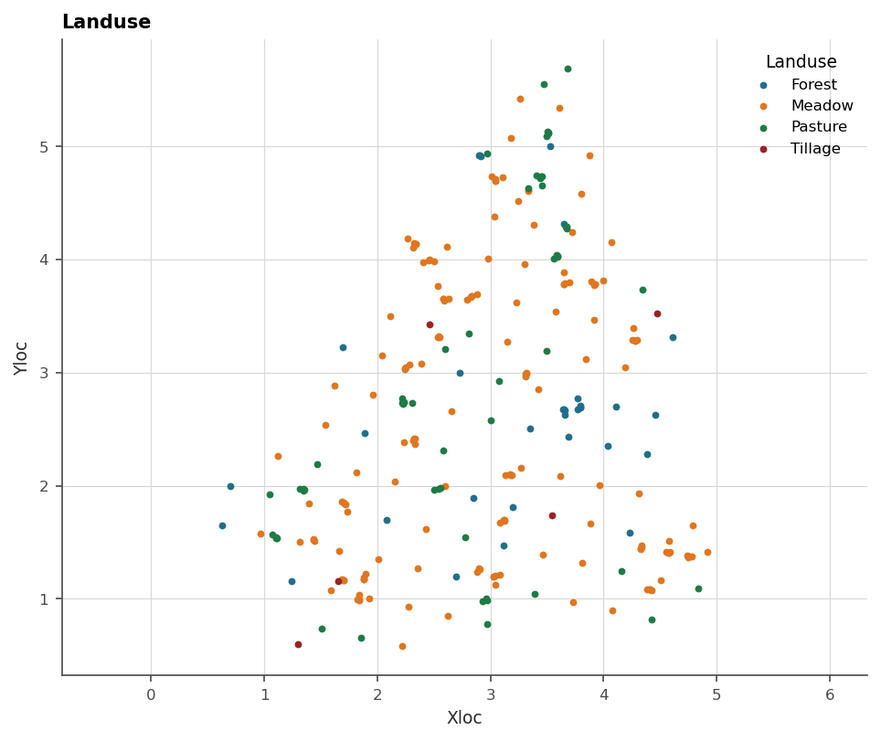
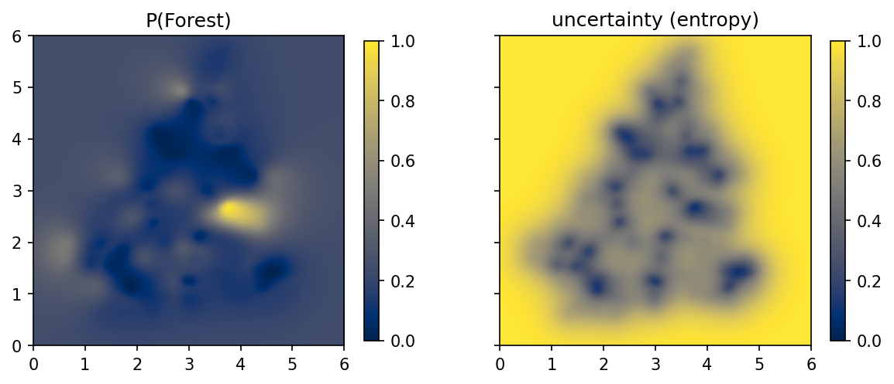

# 6. Categories and boundaries

A rock type is not a number, and pretending it is one, which is indicator
kriging's move, buys a workflow at the price of coherence: probabilities
that do not sum to one, order relations violated, and no *boundary*
anywhere, just a raster of memberships. This chapter models categories the
way the package models everything else, with latent fields, and gets three
things out of one construction: coherent probabilities, an uncertainty
map, and contacts as genuine surfaces.

## 6.1 One field per category

Give each of $C$ categories its own latent field, and let a location
belong to the category whose field is highest there. The fields are not
observed. What is observed is the *winner*, a logged interval, and the
likelihood turns each observation into the statement "this category's
field beats the others here", which is information about differences
between fields. Class probabilities follow from how confidently each field
wins, and they sum to one by construction, because exactly one field wins.

The geological reading is the implicit model: what matters is not any
field's magnitude but **where two fields cross**. The quantity the package
computes per category is its log-odds against its best rival, positive
where the category rules and negative where it loses, and the **contact is
that quantity's zero level set**. A boundary is then a contour like any
grade shell, which chapter 12 extracts as a mesh, and it carries model
uncertainty like everything else. Where the fields cross at a shallow
angle the boundary is soft, and the entropy map says so.

Drillholes contribute two kinds of observation, and the distinction is
worth respecting when the data is prepared (chapter 9). **Interior
points** are where a category was logged along an interval. **Contacts**
are where two categories meet at a measurable depth, a zero-support
observation that pins the crossing exactly. `DrillholeData.get_contacts`
and `as_classification_input` produce both, which is the construction of
the 2023 implicit-modelling paper.

> **In the code.** `geoml.likelihood.CategoricalGaussianIndicator` is the
> likelihood, and the variable side is `CategoricalVariable` or
> `RockTypeVariable`, the latter carrying the two-sided measurements a
> contact has. Per category you get `probability`, the indicator columns,
> and the log-odds (`ind_skew`) whose zero is the contact. Per variable you
> get `predicted`, the winning label, and `uncertainty`, the normalized
> entropy. `GradientIndicator` adds structural data, dip and strike read as
> derivatives of the fields, through the same door.

## 6.2 Jura's land use, mapped with its doubt

The Jura dataset carries four land-use classes, a rock type and seven
heavy metals at 259 sites, with 100 more held out for validation. This
chapter uses the land use alone, and chapter 16 comes back for the rest.

```python
import os

import geoml
import numpy as np
import matplotlib.pyplot as plt

os.makedirs("figures", exist_ok=True)
geoml.set_seed(1234)

jura_train, jura_validation = geoml.datasets.jura()
print(jura_train.tree())

labels = list(jura_train.get("Landuse").labels)
print(labels)
```

The tree shows what a categorical variable holds before anything is
predicted: the logged labels in `measurements_a` and `measurements_b`, a
`boundary` flag marking contacts, and one child node per category.

```python
figure = geoml.plots.Explorer(jura_train, categorical="Landuse").scene()
figure.savefig("figures/06-jura-landuse.png", dpi=150,
               bbox_inches="tight")
```



At 259 sites the data itself is a perfectly good inducing set, so the
network is as short as it gets. A Matérn kernel keeps the boundaries from
being artificially smooth.

```python
root = geoml.latent.BasicInput(
    inducing_points=jura_train,
    transform=geoml.transform.Isotropic(0.5))

gp = geoml.latent.BasicGP(
    root,
    size=len(labels),
    kernel=geoml.kernels.Matern32())

model = geoml.models.VGPNetwork(
    jura_train, "Landuse",
    geoml.likelihood.CategoricalGaussianIndicator(n_components=len(labels)),
    gp,
    options=geoml.models.GPOptions(verbose=False))

model.train_full(max_iter=150)

grid = geoml.data.Grid2D(start=[0, 0], end=[6, 6], n=[201, 201])
model.predict(grid)
```

The prediction fills the grid with the winning label, the per-category
probabilities, and the entropy:

```python
probability = grid.get("Landuse/%s/probability" % labels[0]).as_image()
uncertainty = grid.get("Landuse/uncertainty").as_image()

figure, axes = plt.subplots(1, 2, figsize=(9.5, 4.2), sharey=True)

for ax, image, title in zip(
        axes, [probability, uncertainty],
        ["P(%s)" % labels[0], "uncertainty (entropy)"]):
    drawn = ax.imshow(image, origin="lower", cmap="cividis",
                      extent=(0, 6, 0, 6), vmin=0, vmax=1)
    figure.colorbar(drawn, ax=ax, shrink=0.8)
    ax.set_title(title)

figure.savefig("figures/06-jura-probability.png", dpi=150,
               bbox_inches="tight")

total = sum(grid.values("Landuse/%s/probability" % label)
            for label in labels)
print("probabilities sum to one:", bool(np.allclose(total, 1.0)))
```



The entropy map is the one to show a geologist first. It saturates
everywhere outside the sampled area, where the model has nothing to go on
and says so instead of extending the nearest class over the whole square.
Inside the sampled area it rises along the boundaries, where the winning
field wins narrowly, which is exactly where a mapped contact should be
doubted. Chapter 12 turns the log-odds zero into an actual surface for a
3D case, and chapter 17 does it on a real deposit with contacts read from
drillholes.

## Further reading

The 2023 implicit-modelling paper for the boundary likelihood and the
comparison with radial-basis implicit modelling; the 2021 structural-trend
paper for dip-and-strike data read as field derivatives; the 2025 paper
for categories through deep networks.

## References

Gonçalves, Í. G. *et al.* (2021). A machine learning model for structural
trend fields. *Computers & Geosciences*.
<https://doi.org/10.1016/j.cageo.2021.104715>

Gonçalves, Í. G. *et al.* (2023). Variational Gaussian processes for
implicit geological modeling. *Computers & Geosciences*.
<https://linkinghub.elsevier.com/retrieve/pii/S0098300423000274>

Gonçalves, Í. G. *et al.* (2025). Uncertainty propagation in deep Gaussian
process networks. *Mathematical Geosciences*.
<https://doi.org/10.1007/s11004-025-10187-4>

Lajaunie, C., Courrioux, G., & Manuel, L. (1997). Foliation fields and 3D
cartography in geology: principles of a method based on potential
interpolation. *Mathematical Geology*, 29(4), 571–584.
