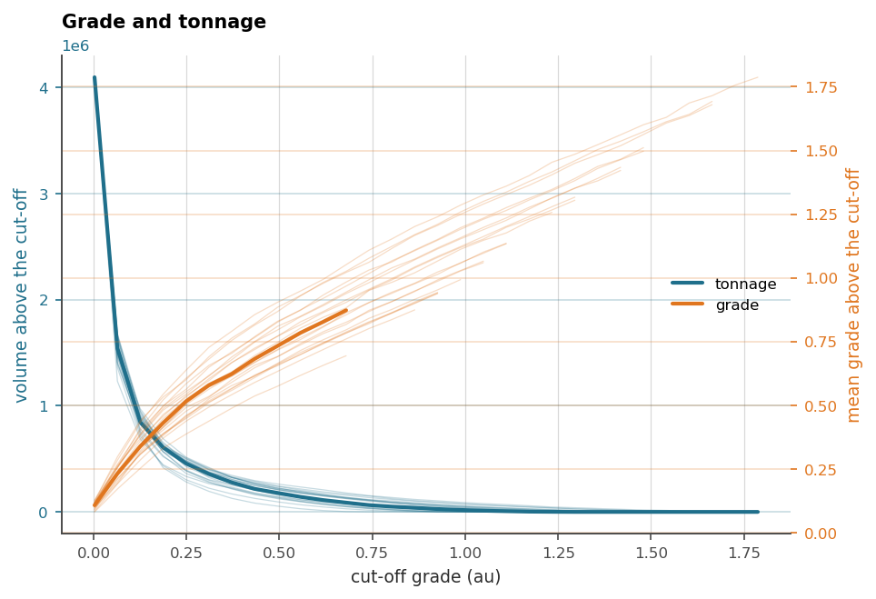

# 8. Change of support

Samples are points, and decisions are blocks. Between the two sits the
oldest problem in mining geostatistics: a block's grade distribution is
narrower than a point's, selectivity depends on support, and a resource
computed at the wrong support is wrong in the direction that costs money.
The classical toolkit corrects distributions after the fact, with affine
and lognormal corrections or the discrete Gaussian model. This package
takes the direct road instead and **predicts the block as the average it
is**, by discretizing it, carrying every sub-block through the full model
(warping, noise doctrine and all) and averaging in the variable's own
units. That is exact with respect to the model, needs no correction
formula, and the same machinery then decides *where the block model itself
should be finer*.

## 8.1 What a block prediction reports

A block fans out into sub-blocks on its way through the model, and comes
back with the three variances of chapter 4 finally all on stage:

| column | the question |
|---|---|
| `prediction` | the block's value, the average of its interior |
| `latent_variance` | how sure the model is of that value |
| `dispersion` | how much the ground varies *inside* the block |
| `noise_variance` | how far an assay of it would scatter |

`dispersion` is the volume–variance story told per block. It grows with
block size and shrinks with continuity, and it is computed from the same
field as the value, so the block and the statement about its interior
never disagree.

Cut-offs make it operational. Declared once, on the data
(`variable.set_cutoffs([...])`), they travel with the variable to every
container predicted from it, and each block reports two different things
about each cut-off:

- `proportions` is the share of the block above the cut-off, the
  recoverable fraction, the number a grade–tonnage curve integrates;
- `divided` is how often the *realizations disagree about whether the
  cut-off crosses the block*. This is the one that licenses refinement. A
  block whose realizations all agree, all ore or all waste, holds one
  answer however finely it is cut, while a block the cut-off genuinely
  crosses holds two, and only cutting can separate them.

## 8.2 The block model that refines itself

`BlockSet3D` is a variable-size block model with octree discipline. Every
block's origin and size are whole numbers of a base cell, `split` keeps
the model tiling its box exactly, and `discretization` is both the
sub-block fan-out and the refinement ratio, so `(2, 2, 1)` refines in plan
and leaves the bench height alone. `models.refine` drives the loop:
predict coarse, cut every block that is undecided about a cut-off, that a
given surface crosses, or that sits more than one level coarser than its
neighbour, then predict *only* what the cutting created, and repeat until
nothing asks. The lattice's `max_levels` bounds the whole affair by
construction.

The example is a synthetic ore pod in a barren domain, which is the shape
refinement exists for.

```python
import os

import geoml
import numpy as np

os.makedirs("figures", exist_ok=True)
geoml.set_seed(1234)
rng = np.random.default_rng(1234)

# 500 samples of a single pod centred in a 160 m cube
xyz = rng.uniform(0, 160, size=[500, 3])
radius = np.linalg.norm(xyz - np.array([80.0, 80.0, 80.0]), axis=1)

point = geoml.data.PointData.from_array(xyz)
point.add_continuous_variable(
    "au", 4.0 * np.exp(-(radius / 28.0) ** 2) + 0.02)
point.get("au").set_cutoffs([1.0])

print(point.tree())
```

```python
inducing = geoml.data.inducing.from_kmeans(point, 150, seed=0)

root = geoml.latent.BasicInput(
    inducing,
    transform=geoml.transform.Isotropic(22.0))

gp = geoml.latent.BasicGP(
    root,
    size=1,
    kernel=geoml.kernels.Gaussian())

# a grade cannot be negative, and a grade-tonnage curve that runs past
# zero is the first thing a reviewer will notice (chapter 4)
warping = geoml.warping.ChainedWarping(
    geoml.warping.Softplus(1),
    geoml.warping.ZScore(1))

model = geoml.models.VGPNetwork(
    point, "au",
    geoml.likelihood.Gaussian(warping),
    gp,
    options=geoml.models.GPOptions(verbose=False))

model.train_full(max_iter=150)
```

Now the block model. Benches are flatter than they are wide, so the blocks
are 20 × 20 × 10 m, and the cube takes 8 × 8 × 16 of them. `start` is the
*centre* of the first block, which is why it is half a block in from the
corner.

```python
blocks = geoml.data.BlockSet3D(
    start=[10, 10, 5],
    n=[8, 8, 16],
    step=[20.0, 20.0, 10.0],
    discretization=(2, 2, 2),
    max_levels=2)

blocks = geoml.models.refine(model, blocks, n_sim=20)

level, count = np.unique(blocks.level, return_counts=True)
print("blocks per level:", dict(zip(level.tolist(), count.tolist())))
print("volume preserved:",
      bool(np.isclose(blocks.block_volume.sum(), 160.0 ** 3)))
```

The refinement went where the cut-off is, the shell of the pod, and
nowhere else. The barren bulk stays coarse, the total volume is exact, and
the finest blocks trace the boundary the decision actually depends on.
This is the economy of the design: resolution is spent where the *answer*
is uncertain, not where the field is merely variable.

## 8.3 The curve it was all for

The grade–tonnage curve reads straight off the refined model, each block
entering at its own volume, the realizations carried through one by one so
that the curve comes with its own uncertainty:

```python
figure = geoml.plots.Explorer(blocks, continuous="au").grade_tonnage()
figure.savefig("figures/08-grade-tonnage.png", dpi=150,
               bbox_inches="tight")
```



The spread between the thin curves is what the model does not know about
the answer, which is the number a competent person actually needs beside
the estimate. Chapter 12 takes the same blocks to surfaces and exports,
and chapter 14 to the reporting figures.

> **In the code.** `data.BlockSet3D` and `RotatedBlockSet3D`, with the
> criteria `needs_splitting`, `unbalanced` and `crossed_by`, and
> `models.refine` as the driver. Design and measurements:
> `docs/variable-block-models.md`.

## Further reading

Journel & Huijbregts (1978) and Chilès & Delfiner (2012) for the change of
support classically; David (1977) for its mining consequences;
`docs/variable-block-models.md` for this implementation's design record
and the measured accuracy of the refinement criteria.

## References

Chilès, J.-P., & Delfiner, P. (2012). *Geostatistics: Modeling Spatial
Uncertainty* (2nd ed.). Wiley.

David, M. (1977). *Geostatistical Ore Reserve Estimation*. Elsevier.

Journel, A. G., & Huijbregts, C. J. (1978). *Mining Geostatistics*.
Academic Press.
