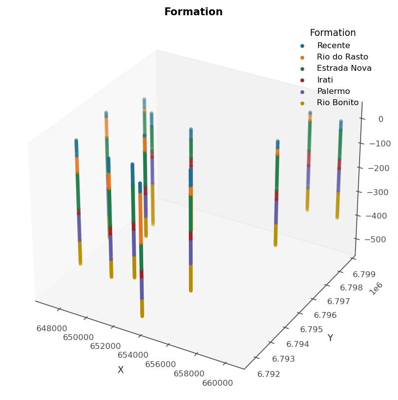

# 9. From database to data

Models see points, and a mine keeps collars, surveys and interval tables.
`DrillholeData` is the bridge, and it is deliberately a *one-way* one. It
desurveys, validates, composites and converts, but it is never fed to a
model. Only what it produces is. That separation keeps the database
manipulations, which must be auditable, apart from the modelling, which
must be fast, and it is why the class leans on pandas while everything
downstream leans on arrays.

## 9.1 Ingesting: rename at the door

The constructor takes the collar table, optionally a survey, plus the
*names your database uses*, and renames everything to canonical columns on
the way in. Whatever the file called them, holes become `HOLEID` and
intervals become `FROM`/`TO`. Reaching for the original names afterwards
is a deliberate `KeyError`: one spelling inside the package, however many
outside. Interval tables join by name, each with per-column **roles**
declared once: `grade` (composited by length × density when a `density`
column is declared), `categorical`, `density`, `recovery` (composites by
length, never weights a grade, converts to metadata), `flag` and `ignore`.

Desurveying is minimum curvature, with a straight-line fallback along the
collar attitude and a warning when a hole has neither. Interval
coordinates are never stored. They are computed on demand, which is what
keeps compositing exact instead of accumulating rounding.

The bundled Araranguá set shows the shape of it: 13 vertical holes and one
lithology table.

```python
import os

import geoml

os.makedirs("figures", exist_ok=True)

holes = geoml.datasets.ararangua()
print(holes)
```

## 9.2 Compositing: one support before anything else

Assays come at the lengths the geologist cut, and mixed supports are a
quiet bias, because a long rich interval and a short poor one are not two
equal votes. Compositing regularizes the support, and the class offers
three deliberate flavours:

- `composite(length, domain="litho")` is the default, honouring domain
  boundaries so that no composite straddles a contact;
- `composite_fixed(length)` uses a fixed length regardless;
- `composite_to("assay")` puts every table onto one table's support, which
  is what makes the point conversion a one-to-one merge.

Each returns a *new* `DrillholeData` with every table on the shared
support. On a real assay database the round trip reproduces the assays to
about 1e-13, and a hand-computed mass-weighted composite matches exactly.
The tests pin both.

## 9.3 Converting: what the models actually receive

`as_point_data()` produces the `PointData` the models take, and every
conversion carries three columns as **metadata**, which are per-location
facts the models never see: the hole id (`HOLEID`), the depth down the
hole (`DEPTH`) and the sample length (`LENGTH`). The identifier is what
leave-one-hole-out validation splits on (chapter 13), the length is what a
weighting scheme reads, and the depth is what a contact profile measures
from: `Explorer.contact` puts a grade against its distance down the hole
to the nearest contact between two domains, which is the figure the
hard-or-soft boundary decision is read from before anything is modelled.
This database logs no assays, so the chapter cannot draw one. All three
travel with the data through subsetting, prediction and Zarr, and none is
modelled.

For categories, the conversion of chapter 6 gives interior points plus the
contacts between domains, the latter carrying both neighbouring classes at
zero support:

```python
point = holes.as_classification_input(("lito", "Formation"), length=5.0)
print(point.tree())

print(point.n_data, "points from",
      len(set(point.get_metadata("HOLEID"))), "holes")
```

The table carries three categorical columns (`Lito`, `Formation`,
`Layer`), so the conversion asks for the one it should model rather than
guessing, as the error message tells you if you let it.

```python
figure = geoml.plots.Explorer(point, categorical="Formation").scene()
figure.savefig("figures/09-ararangua-classification.png", dpi=150,
               bbox_inches="tight")
```



> **In the code.** `geoml.data.DrillholeData` and `IntervalTable` in
> `data/drillhole.py`: `add_intervals`, `set_role`, `rename_table`,
> `drop_table`, the three composites, `as_point_data(position=,
> drop_missing=)`, `get_contacts` and `as_classification_input`. One
> sign-convention gotcha the constructor exposes as `dip_positive_down`:
> geoML reads a positive dip as downward, and many databases record
> downward holes as negative. Getting it wrong mirrors every hole through
> its collar, which is obvious in a 3D view and invisible in a summary, so
> look at the traces before modelling anything.

## Further reading

The compositing conventions follow standard practice. Abzalov (2016) is a
thorough treatment of drillhole data preparation and its pitfalls, and the
2023 implicit-modelling paper covers what `as_classification_input` feeds.

## References

Abzalov, M. (2016). *Applied Mining Geology*. Springer.

Gonçalves, Í. G. *et al.* (2023). Variational Gaussian processes for
implicit geological modeling. *Computers & Geosciences*.
<https://linkinghub.elsevier.com/retrieve/pii/S0098300423000274>
