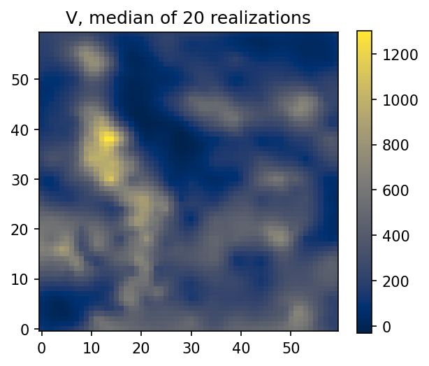

# 10. Containers and addressing

Everything a model reads or writes lives in a **container**: `PointData`
for scattered samples (`GaussianData` when their coordinates carry a
variance, which chapter 5's `GaussianInput` reads), `Grid1D`/`Grid2D`/
`Grid3D` for regular lattices,
`BlockSet3D` for the refinable block model of chapter 8, plus the
directional and mesh types the later chapters use. They differ in how they
hold coordinates and agree on everything else, and this chapter is about
that shared part: how to find a number, how to get it out, and how to move
a container between scripts.

## 10.1 One tree, addressed by path

A container is a tree of variables, their components, their attributes and
per-location metadata. Every leaf has a **path**, and the path is the one
true name: the same spelling in memory, in the Zarr store, and in this
manual.

Four verbs cover almost everything.

| call | what it gives you |
|---|---|
| `container.tree()` | the picture: every variable and every column |
| `container.values(path)` | the column as a NumPy array |
| `container.get(path)` | the column object, for drawing and contouring |
| `container.select(pattern)` | the paths matching a glob |

`tree()` first, always, and especially after a prediction:

```python
import os

import geoml
import numpy as np

os.makedirs("figures", exist_ok=True)
geoml.set_seed(1234)

walker, walker_grid = geoml.datasets.walker()

covariance = geoml.kernels.Covariance(
    kernel=geoml.kernels.Spherical(),
    transform=geoml.transform.Isotropic(100.0))

model = geoml.models.GP(
    data=walker,
    variable="V",
    covariance=covariance,
    warping=geoml.warping.ZScore(1),
    options=geoml.models.GPOptions(verbose=False))

model.train(20)

grid = geoml.data.Grid2D(start=[1, 1], n=[60, 60], step=[4.3, 5.0])
model.predict(grid, n_sim=20)

grid.get("V").reset_quantiles([0.1, 0.5, 0.9])

print(grid.tree())
```

Everything the model wrote is a leaf in that tree: the prediction, the
variances, the realizations and the quantiles. Reading a value is then a
matter of spelling its path.

```python
prediction = grid.values("V/prediction")
median = grid.values("V/quantiles/0.5")
spread = grid.values("V/quantiles/0.9") - grid.values("V/quantiles/0.1")

print(prediction.shape, median.shape, spread.shape)
print("mean grade:", round(float(np.mean(prediction)), 1))
print("mean 0.1-0.9 spread:", round(float(np.mean(spread)), 1))
```

`select` answers the same question with a glob, which is how a script
loops over things it did not name in advance:

```python
print(sorted(str(path) for path in grid.select("V/quantiles/*")))
print(sorted(str(path) for path in grid.select("**/prediction")))
```

`select` hands back path objects rather than strings, which is why they
are printed through `str`. Anywhere a path is expected, either form is
accepted.

**`values` for what you compute with, `get` for what you draw.** `values`
returns a plain array, decoded if the column stores text as integer codes.
`get` returns the column object, which knows things an array does not: how
to reshape itself onto a grid (`as_image`), how to contour itself into a
surface (`get_contour`), and what its labels are.

```python
import matplotlib.pyplot as plt

image = grid.get("V/quantiles/0.5").as_image()

figure, axes = plt.subplots(figsize=(4.6, 4.4))
drawn = axes.imshow(image, origin="lower", cmap="cividis")
figure.colorbar(drawn, ax=axes, shrink=0.85)
axes.set_title("V, median of 20 realizations")
figure.savefig("figures/10-median.png", dpi=150, bbox_inches="tight")
```



One trap worth naming once. `get(path).values` is not an array, it is the
storage object behind the column, and converting a large one into an array
loads the whole thing into memory. Use `values(path)` when an array is
what you want.

## 10.2 The paths a model writes

Most of the manual is spent reading these, so here they are in one place.
`V` stands for a continuous variable's name and `<c>` for a cut-off.

| path | what it holds |
|---|---|
| `V/measurements` | what was observed, where anything was |
| `V/prediction` | the model's value for the ground |
| `V/latent_variance` | how sure the model is |
| `V/noise_variance` | how far a measurement would scatter |
| `V/dispersion` | how much the ground varies inside a block |
| `V/simulations/<i>` | one realization |
| `V/quantiles/<q>` | a quantile of the realizations |
| `V/proportions/<c>` | the share above a cut-off, on a block model |
| `V/divided/<c>` | how often the realizations disagree about the cut-off |

The last two appear only where a block has an interior for the cut-off to
cross, so they are written by a `BlockSet3D` prediction and not by a grid
or a point one (chapter 8).

A vector or compositional variable puts its components one level down, so
Jura's zinc is `Elements/Zn/prediction`. A categorical variable reports
`Landuse/predicted` and `Landuse/uncertainty` for the whole variable, and
`Landuse/Forest/probability` for a single class. Metadata, the per-location
facts of chapter 9, sits under `_metadata/`:

```python
print(sorted(str(path) for path in walker.select("**"))[:6])
```

Besides its columns, a variable carries a few **facts** — the cut-offs it
is judged against, and the unit it is measured in. They are not arrays, and
`tree()` prints them beside the variable's name; `container.units()` lists
every declared unit by path. Everything a column holds is in that unit,
which for a composition's part means the one it was assayed in rather than
the fraction the model works with (§9.4).

## 10.3 Getting the numbers out

Three doors, by destination, and one of them is not an export at all.

```python
import tempfile

frame = grid.as_data_frame()
print([name for name in frame.columns if name.startswith("V_")][:5])

path = os.path.join(tempfile.mkdtemp(), "walker-grid.zarr")
grid.to_zarr(path)
back = geoml.data.Grid2D.open(path)

print(type(back).__name__, back.n_data,
      bool(np.allclose(back.values("V/prediction"),
                       grid.values("V/prediction"))))
```

`as_data_frame` flattens the paths into column names
(`V_quantiles_0.5`) for spreadsheets and general software.
`as_pyvista` does the same for 3D viewers, with a prettier spelling
(`V - prediction`), and carries the mapping back to real paths alongside
the mesh, so nothing has to be parsed out of a name.

`to_zarr` is the one that is not an export. It writes the entire
container, coordinates, every variable's tree, metadata and simulations
included, and `open` rebuilds it with its type intact. It is lossless and
appendable, a reopened container can be predicted into again, and it is
the natural hand-off between a modelling script and a reporting one. Model
persistence (chapter 11) is a separate mechanism for a separate thing: a
*model* is constructors and parameters, a *container* is arrays.

## 10.4 When the ensemble outweighs the machine

A block model's simulations run to hundreds of gigabytes on real jobs, so
containers keep their arrays in a store that is memory-resident when small
and chunked on disk when not. Chunks split the *location* axis only, so a
chunk holds whole rows: every realization of a band of blocks. Two habits
follow, and they are the only two worth remembering.

**Read one realization at a time.** A realization has a path of its own,
and reading it costs one column of memory whatever the store holds. This
is the primitive under the per-realization arithmetic of chapter 7:

```python
first = grid.values("V/simulations/0")
print(first.shape, round(float(first.mean()), 1))

# the same column as a drawable attribute, for as_image or get_contour
drawable = grid.get("V").simulation(0)
print(type(drawable).__name__)
```

**Reduce over locations a band at a time.** Everything in the package that
summarizes an ensemble (quantiles, cut-off shares, grade–tonnage curves,
the figures) walks the store in bands and holds one at a time. Code you
write should do the same. The one call to avoid is asking a large
simulations store to become a single array, which on a real block model
will end the session.

> **In the code.** The tree machinery lives in `data/base.py`, the
> containers in `data/containers.py` and `data/grids.py`, Zarr persistence
> in `data/io.py`, and the store in `storage.py`. Design record for the
> addressing: `docs/variable-paths.md`.

## Further reading

`docs/variable-paths.md` and `docs/variable-block-models.md` are the design
records behind this chapter, and the Zarr documentation covers the store
format the persistence rests on.
