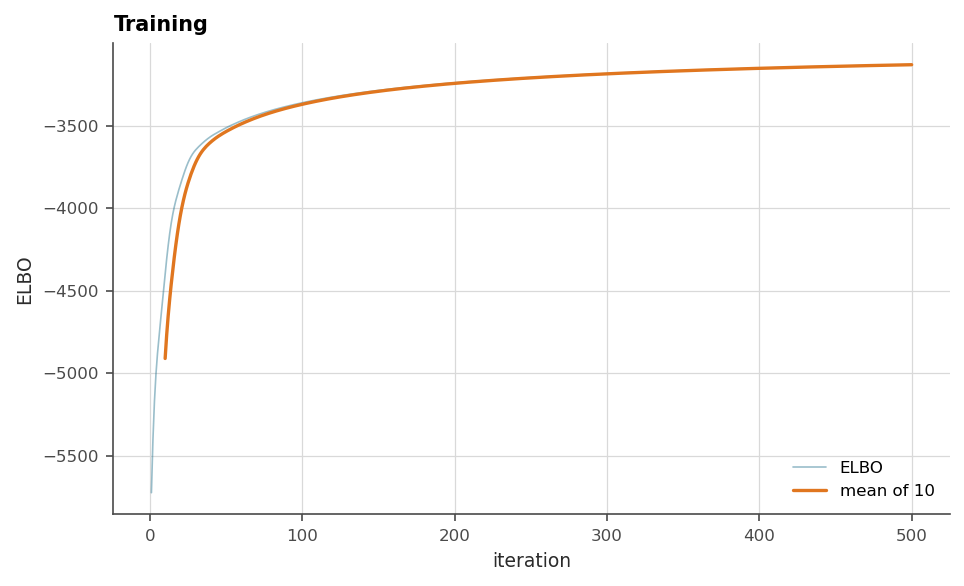

# 11. Building and training

The theory chapters introduced every part. This one is the assembly
manual: the order things must happen in, the knobs that matter, and the
habits that make a model reproducible and recoverable. It is short on new
ideas and long on the things that cost an afternoon when learned by
surprise.

## 11.1 The order of construction

One rule outranks the others: **seed first, then build**. Parameter
initialization draws from the package generator at construction, and a
model's options draw their own seed, for training's Monte Carlo and the
simulation stream, from the same generator when they are created. One call
before any object exists makes the whole pipeline replayable.

```python
import os

import geoml
import numpy as np

os.makedirs("figures", exist_ok=True)
geoml.set_seed(1234)          # before ANY model object is built

walker, walker_grid = geoml.datasets.walker()
```

Then the assembly, in the order the pieces depend on each other: inducing
points, input node, GP node, warping, likelihood, model. Each one gets its
own name, which costs a line and buys a network you can inspect a piece at
a time.

```python
experts = geoml.data.inducing.grid_experts(walker_grid, 10.0, block=8)

root = geoml.latent.BasicInput(
    experts,
    transform=geoml.transform.Isotropic(50))

gp = geoml.latent.BasicGP(
    root,
    size=1,
    kernel=geoml.kernels.Spherical())

warping = geoml.warping.ChainedWarping(
    geoml.warping.BoxCox(1),
    geoml.warping.ZScore(1))

likelihood = geoml.likelihood.Gaussian(warping)

model = geoml.models.VGPNetwork(
    walker, "V",
    likelihood,
    gp,
    options=geoml.models.GPOptions(verbose=False))

print(model)
```

The `repr` is the model document: every node, every parameter, its bounds
and whether it is fixed. Read it before training the way a variogram model
is read before kriging. Most "why is it doing that" questions are answered
in it.

Multi-variable models pass lists in matching order (`["Elements",
"Landuse"]` with a likelihood each). Two places are worth a moment's
thought before training starts: the initial `transform` range, and the
warping chain. Initialization is not fitting, but a range wrong by an
order of magnitude starts the climb in a bad valley, and a chain without a
positivity link will happily predict a negative grade (chapter 4).

## 11.2 Training, watching, adjusting

`train_full(max_iter=...)` for datasets that fit in a batch, `train_svi`
past that (chapter 3). Adam runs underneath, and `set_learning_rate` is
there for when the default is too bold for a delicate warping. Two habits
matter.

```python
model.train_full(max_iter=500)

figure = geoml.plots.Explorer(walker, continuous="V",
                              model=model).training_curve()
figure.savefig("figures/11-training-curve.png", dpi=150,
               bbox_inches="tight")
```



The first habit is to watch the running mean of the ELBO until it is flat.
An unsettled fit gives seed-dependent answers, which is a reproducibility
problem wearing a modelling problem's clothes. The curve above is worth
looking at closely: it rises steeply for the first fifty iterations and
then keeps creeping for hundreds more. The steep part is the model finding
the right scale, and the creep is the warping and the variational state
settling against each other. Stopping at the elbow is the common mistake,
and the flat tail is what the eye should be waiting for.

The second is to train in *rounds*. Another `train_full` call continues
where the last one stopped, so predict, look and resume is the intended
rhythm rather than a trick.

Two `GPOptions` are worth knowing beyond the defaults. `jit_predict=True`
compiles prediction with XLA, measured at 3–5× on big grids, and is off by
default because XLA refuses what it cannot compile instead of falling
back. `training_samples` sets the Monte Carlo width of the ELBO estimate,
and the default serves. Raise it only when the curve is too noisy to read.

## 11.3 Saving, loading, resuming

A trained model persists whole: structure, parameters, training data, even
the seed it drew, so a reloaded model *replays its simulations exactly*.

```python
import tempfile, os

os.makedirs("figures", exist_ok=True)
path = os.path.join(tempfile.mkdtemp(), "walker_model")
geoml.persistence.save_model(model, path)

restored = geoml.persistence.load_model(path)

fresh_grid = geoml.data.Grid2D(start=[1, 1], n=[50, 50], step=[5.2, 5.6])
restored.predict(fresh_grid, n_sim=8)

print("the reloaded model predicts:", "V" in fresh_grid.variables)
print("lowest value:",
      round(float(np.min(fresh_grid.values("V/prediction"))), 1))
```

The value is positive, as the `BoxCox → ZScore` chain guarantees --
the inverse power returns zero for anything past its floor -- and it is
the same number the original model would have given.

The mechanism is worth understanding, because two workflows ride on it.
Saving records the *constructor calls* that built every object, plus the
parameter values they arrived at, and loading replays them. One
consequence is that a class recorded in a save must keep its import path
forever, which the package maintains shims for. The useful consequence is
that `load_model(path, data=another_container)` rebuilds the same trained
model *around different data*. That gives you the fitted structure as a
starting point on a new drilling campaign, and it is the mechanism chapter
13's cross-validation uses to build its fold models.

> **In the code.** `models.VGPNetwork`, `models.GPOptions`,
> `persistence.save_model` and `load_model`, and `stats/random.py` for the
> one seed knob.

## Further reading

Chapter 3 for what training optimizes, chapter 13 for judging the result,
and the case studies for three full assemblies with their reasoning
written down.
