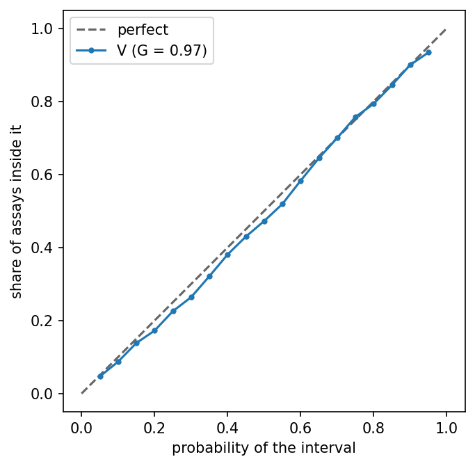
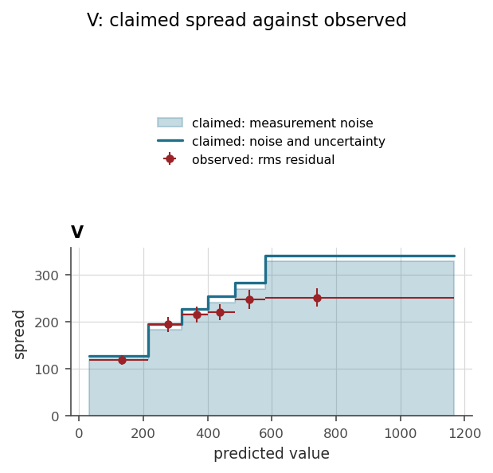
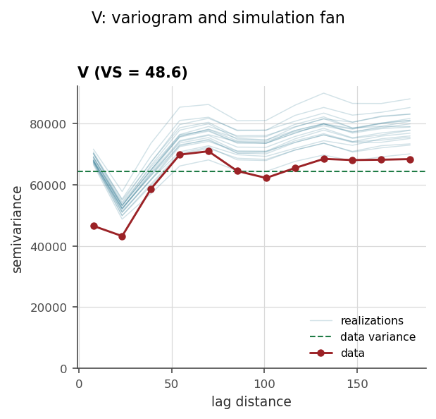
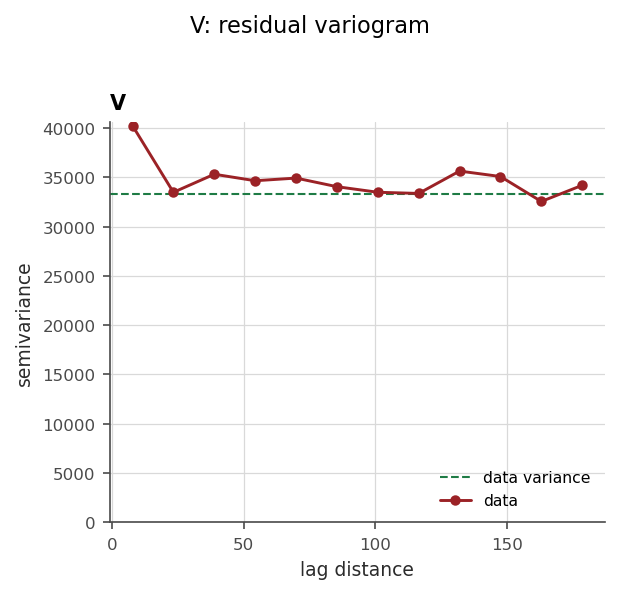
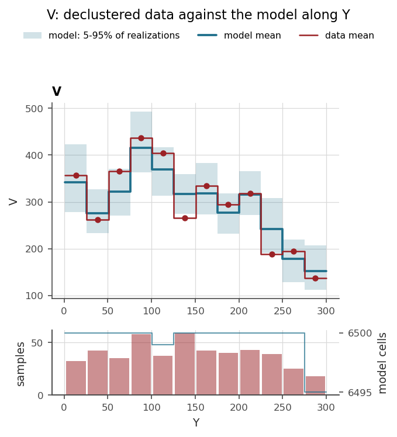

# 13. Validation

A model scored on its own training data flatters itself, and on spatial
data the flattery survives the usual defence. A random k-fold split puts
most held-out samples next to a training sample, and on a drillhole
dataset usually *in the same hole*, and a spatial model answers those by
proximity rather than by understanding. The scores come out excellent, the
block model built from the same fit does not, and the difference was never
going to show, because the validation asked an easier question than the
mine does. The mine asks about ground *between and beyond* the holes.

This chapter is the package's answer, in three moves: build folds that ask
the mine's question, score the model only where it never looked, then
repair what the scores say is miscalibrated. Everything runs on the same
machinery. A metadata column names the folds, one function drives the
cross-validation, and the calibration reads what it leaves behind.

The worked example is the Walker Lake model of chapter 11, trained long
enough to have settled.

```python
import os

import geoml
import numpy as np

os.makedirs("figures", exist_ok=True)
geoml.set_seed(1234)

walker, walker_grid = geoml.datasets.walker()

experts = geoml.data.inducing.grid_experts(walker_grid, 10.0, block=8)

root = geoml.latent.BasicInput(
    experts,
    transform=geoml.transform.Isotropic(50))

gp = geoml.latent.BasicGP(
    root,
    size=1,
    kernel=geoml.kernels.Spherical())

warping = geoml.warping.ChainedWarping(
    geoml.warping.BoxCox(1),
    geoml.warping.ZScore(1))

model = geoml.models.VGPNetwork(
    walker, "V",
    geoml.likelihood.Gaussian(warping),
    gp,
    options=geoml.models.GPOptions(verbose=False))

model.train_full(max_iter=500)
```

## 13.1 Folds that mimic the prediction task

What decides how hard a location is to predict is how far its nearest
training sample sits. A useful validation therefore reproduces the
*distance geometry* of the real task. Held-out samples should be as far
from the training data as the block model's locations are from the
samples: no nearer, or the scores flatter, and no farther, or the
validation tests an extrapolation nobody asked for. This is the
nearest-neighbour distance matching idea (Linnenbrink et al., 2024), and
geoML holds an advantage the ecology literature it comes from does not.
The prediction target is not a guess. It is the grid or block model in
your hands, and `spatial_k_fold` takes it as its first argument.

```python
w, target, achieved = walker.spatial_k_fold(walker_grid, k=5, seed=0)
print("W =", round(w, 2))
```

The method gathers the samples into small groups that are never split
across folds, agglomerates them by cutting a dendrogram of group centroids
at every possible count, and keeps the cut whose held-out-to-training
distance distribution best matches the target's. That match is the
Wasserstein distance `W`, in coordinate units, and zero would be perfect.
The folds land in a metadata column named `"fold"`, and the two returned
distance samples let you *look* at the match instead of trusting it.

Two arguments matter in practice.

- `groups="HOLEID"` names a metadata column whose labels must never be
  split. On drillhole data this is not optional. Samples from one hole are
  near-duplicates, and a fold boundary through a hole leaks like a sieve.
  Every conversion from `DrillholeData` carries the hole id as metadata
  for exactly this reason (chapter 9).
- `name=` renames the output column, so two labellings can sit side by
  side and be compared on their `W`.

Leave-one-hole-out needs no builder at all. Point the next section's
`folds=` argument straight at the hole-id column, and each hole becomes a
fold of its own.

## 13.2 Scoring where the model never looked

Classical kriging cross-validates cheaply, because the solution is a
closed form and removing one sample and re-solving costs little (Rasmussen
& Williams, 2006, §5.4.2, is the GP spelling of the same trick). The
variational model's posterior is *fitted* rather than solved, and
retraining it from scratch once per fold is the cost this package refuses.
`cross_validate` is the translation of what kriging practice actually
does, which is to cross-validate with the variogram held fixed.

- The trained model is saved once, and each fold gets a copy rebuilt
  around the data with that fold removed.
- The copy's **variational state**, the part of a trained model that
  encodes the data, is re-initialized. That makes it *structurally*
  ignorant of the held-out samples, and everything else (kernel, warping,
  noise) is frozen.
- A short refit fits the state to the reduced data, and the held-out rows
  are predicted into one shared container. The folds partition the data,
  so the loop ends with every sample predicted by the one model that never
  saw it.

```python
oof, scores = geoml.models.cross_validate(model, iterations=200, n_sim=20)
print(scores[scores["fold"] == "all"])
```

Why re-initialize rather than warm-start and let the fold "forget" its
held-out samples? Because forgetting was measured and found wanting. On
this very dataset, warm-started fold models score *better than an honest
from-scratch retrain*, an edge no honest scheme can have, which makes it
the residual memory of the held-out data, still there after hundreds of
iterations. Fresh initialization matches the honest retrain within a few
percent at a fraction of the cost. The concession that remains, that the
hyperparameters and warping were fitted on all the data, is the same one
kriging makes when it keeps the variogram. The measurements are in
`docs/cross-validation.md`, and `refit="all"` trades the other way when
you want it.

The score table reads like a drill campaign report, with one row per
variable component and fold, plus a pooled `"all"` row.

- `rmse`, `mae` and `bias` are point errors of the predictive mean. Bias
  is prediction minus truth, so positive means overestimation.
- `crps` is the proper score for a *distribution* against a measured
  value. It rewards putting probability near the truth and punishes both
  hedging and false precision, on the scale of the variable, and it
  reduces to the absolute error for a point prediction.
- `goodness` is Deutsch's accuracy-plot statistic: one when the claimed
  intervals cover exactly as often as they promise, with over-confidence
  penalized twice as heavily as hedging.

One doctrine hides in the scoring, and it matters everywhere in geoML. A
prediction is of the **ground**, with the measurement noise averaged out,
while the held-out values are **assays**, which carry that noise. The two
are not comparable directly, so every score above is computed against the
model's *measurement* distribution, what an assay at that location would
read, and never against the stored ground simulations. Chapter 4 develops
the distinction. Here it is enough that the table is honest about it.

## 13.3 Looking at the failure, not just the number

The out-of-fold container `oof` carries the honest predictions, so the
diagnostic figures finally mean what they show.

The first one is the accuracy plot, the geostatistician's calibration
check. `cross_validate` left behind, as metadata, where each assay fell
inside its own out-of-fold predictive distribution, which is the
probability integral transform (PIT). A central interval of probability
$p$ is the PIT band $|\,\mathrm{PIT} - 0.5\,| \le p/2$, so the share of
assays that actually landed inside it is one line of arithmetic.

```python
import matplotlib.pyplot as plt

pit = oof.get_metadata("pit_V")

nominal = np.linspace(0.05, 0.95, 19)
observed = np.array([float(np.mean(np.abs(pit - 0.5) <= p / 2))
                     for p in nominal])

figure, axes = plt.subplots(figsize=(5.0, 5.0))
axes.plot([0, 1], [0, 1], "--", color="0.4", label="perfect")
axes.plot(nominal, observed, marker="o", markersize=3,
          label="V (G = %.2f)" % geoml.metrics.goodness(nominal, observed))
axes.set_xlabel("probability of the interval")
axes.set_ylabel("share of assays inside it")
axes.set_aspect("equal")
axes.legend(loc="upper left")
figure.savefig("figures/13-accuracy.png", dpi=150, bbox_inches="tight")
```



Below the 1:1 line the intervals are too narrow for the errors they have
to cover, and above it the model is hedging. `goodness` is that departure
summed into one number, and it is the same number the score table
reported.

There is a ready-made `accuracy()` figure on the plotting objects, and it
is the one to use on a genuine validation set (chapter 14 does). It asks
the *model* for measurement intervals at the container's own locations,
which on `oof` would let the full model interpolate its own training data
and flatter itself. The PIT version above avoids that, because the
distributions it summarizes came from the fold models.

Two more figures read the container alone:

```python
explore = geoml.plots.Explorer(oof, continuous="V")

figure = explore.spread_check(bins=6)
figure.savefig("figures/13-spread-check.png", dpi=150,
               bbox_inches="tight")
```



`spread_check` compares the spread the model claimed against the spread
the errors actually had, laid out along the predicted value, and the level
axis says *which* term is at fault. A shortfall that widens with the grade
points at the noise model, and a flat one at the posterior.

```python
figure = explore.variogram(n_lags=12)
figure.savefig("figures/13-variogram-fan.png", dpi=150,
               bbox_inches="tight")

figure = explore.variogram(n_lags=12, residuals=True)
figure.savefig("figures/13-variogram-residuals.png", dpi=150,
               bbox_inches="tight")
```



The `variogram` figure draws the data's experimental variogram against one
thin curve per simulated realization, computed on the same pairs. Two
corrections happen before the comparison is made, and both matter enough
that without them the figure would libel every model it was shown.

**The noise.** The measurements carry the likelihood noise, while the
realizations are of the ground with that noise integrated out (chapter 4),
so the two are not the same quantity. An error of its own at each location
adds $(\sigma_i^2 + \sigma_j^2)/2$ to every pair's contribution, and the
fan is raised by exactly that, read off the `noise_variance` column. Only
the variance enters, never the shape, so nothing is drawn and the figure
carries no seed.

**The clustering.** This one is the deeper trap, and it is not about the
model at all. Samples follow the ore. An experimental variogram computed on
raw pairs therefore describes the *sampling* as much as the field, and on
Walker Lake, whose exhaustive truth is bundled with the package, the raw
sample curve runs 1.4 times the true variogram at the sill and 2.3 times at
the shortest lag. A model reproducing the field perfectly would look badly
over-smooth against it. So each pair is weighted by $w_i w_j$ from
cell-declustering weights, and the sill with it. On Walker Lake that pulls
the average departure from the true variogram from 56% down to 12%, and the
sill from 89 700 to 64 400 against a truth of 61 800.

Only now can the two curves be laid against each other, and the answer is
that this model passes. The fan tracks the data across the whole range,
rising where it rises and levelling where it levels. The realizations walk
like the data.

That verdict is worth pausing on, because it is the opposite of what the
same figure said before the two corrections were applied. Uncorrected, the
fan sat at a sixth of the data's curve at short lags and the model looked
badly over-smooth. Neither error was in the model. One was a comparison
between the ground and a measurement; the other was a comparison against
the sampling rather than the field. **A diagnostic figure that is not
scrupulous about what it puts on each axis will convict an innocent
model**, and it will do so with an air of authority, because a fan far
below a curve looks like evidence.

One caution remains, and it is the reason the shortest lag is the least
trustworthy point here rather than the most damning. Declustering cannot
fully mend that bin: the closest pairs exist mainly *inside* the clusters,
so it is built from crowded, high-value ground however the weights are set.
On this dataset that can be checked, because Walker Lake ships its
exhaustive field, and the check says both curves still sit near twice the
true value at the shortest lag. That is a limit of the *data*, shared by
the model that was fitted to it, and no weighting recovers it.



The residual version asks the question no per-location score can: is there
spatial structure left in `measured - predicted`? Structure in the
residuals is structure the model missed, whether a range fitted too short,
an anisotropy overlooked, or a trend unmodelled. On the out-of-fold
container it is honest by construction.

Here it is flat at its sill from the second lag on, with only the shortest
bin riding high — the same crowded, high-value bin the caution above named
as the least trustworthy point in either figure. Flat at the sill is what
"nothing left" looks like: the residuals are noise with no spatial
organization worth naming. That agrees with the fan above, and the two agreeing is
worth more than either alone, because they fail in different ways. The fan
would miss a model that got the structure right and the level wrong; the
residual variogram would miss one whose realizations were individually too
smooth while the mean was right.

One more figure, and it is the one that *localizes* a bias where every
score so far aggregated it away. A model can be unbiased over the whole
deposit and still run high in the north and low in the south, and only a
mean per slab shows where it drifts. That is the swath plot, and the
package's version carries the two corrections without which it describes
the drilling rather than the deposit.

```python
walker.decluster(on="V")
model.predict(walker_grid, n_sim=20)
walker_grid.assign_from_data(walker, distance=15.0, hull=40.0)

figure = geoml.plots.Explorer(walker, continuous="V").swath(
    walker_grid, axis="Y", bins=12, where="near_data")
figure.savefig("figures/13-swath.png", dpi=150, bbox_inches="tight")
```



The first correction is the one §13.3 already made for the variogram: the
data's slab means are **declustered**, through the column `decluster()`
stores, so a crowded patch of samples speaks once rather than twenty
times. The second is new, and it is the part a swath plot usually gets
wrong. The model's slab means run over the *grid*, and a grid holds ground
the samples never spoke for -- air, waste, the far corners of the box --
where the model is extrapolating and its mean says nothing a sample could
be compared with. `assign_from_data` names the ground the data informs:
within a distance of a sample, inside the data's concave hull at a chosen
length, or both. The hull is what makes it honest on drilling: it fills
the interior between fences closer than its length, where a ball around
each hole would leave a gap, and leaves out a notch wider than that, where
a convex hull would bridge across. On a drillhole dataset the lengths go
through a `transform` -- an `Anisotropy3D` with the ranges of the drilling,
dense down the hole and sparse across -- so that "near" means what the
geometry means by it. Walker Lake's samples cover the whole area, so here
the column changes little; on a block model built around a deposit it is
the difference between a swath and a lie.

The band is what a kriging swath cannot draw: each realization's slab mean
taken separately, and the two quantiles between them. The data's mean
sitting inside it, slab after slab, is the model saying it did not know
better -- outside it, the model saying it did.

## 13.4 Holding the intervals to their word

The scores may now say the intervals are miscalibrated, with a `goodness`
well below one and coverage that misses its nominal level. Refitting the
model is the real cure. Conformal calibration is the honest patch, and it
comes with a guarantee. It is built on the same PIT columns the accuracy
plot above used, mapped into one monotone correction:

```python
calibration = geoml.models.conformalize(oof, "V")
print(round(calibration.nominal(0.9), 3))
```

`nominal(0.9)` answers a practical question: at what level must a central
interval be cut so that it *actually* covers 90% of fresh measurements?
For a calibrated model the answer is 0.9 and nothing changes. Above it,
the model claimed more precision than it delivered, and the returned level
is exactly how much wider to cut. The finite-sample guarantee of split
conformal prediction rides on the folds, since exchangeability fails point
by point on spatial data, and folds that mimic deployment (§13.1) are what
makes the out-of-fold PITs stand for the prediction task.

Applying it takes measurement samples at new locations:

```python
new_points = geoml.data.PointData.from_array(
    np.asarray(walker_grid.coordinates)[::100])

samples = model.predict_measurements(new_points, n_sim=20)["V"]
lower, upper = calibration.interval(samples[:, 0, :], coverage=0.9)

print(lower.shape, round(float(np.mean(upper - lower)), 1))
```

Three limits, stated rather than discovered.

- The intervals are of **measurements**. The ground is never observed, so
  there is nothing to calibrate a ground interval against.
- The guarantee is worth as much as the folds resemble deployment, which
  is why the calibration and the fold builder are one pipeline rather than
  two features.
- The repair is bounded by the ensemble's own range. `nominal(q) == 1.0`
  is a warning that the model was too sure for its own samples to say how
  much wider the interval must be. Raise `n_sim`, or fix the model rather
  than the interval.

> **In the code.** `PointData.spatial_k_fold` builds the folds,
> `models.cross_validate` drives the loop and returns the out-of-fold
> container and the score table, and `models.conformalize` reads the PIT
> metadata. The scores live in `geoml.metrics` and are also reported by
> every continuous variable's `compute_metrics()`. Design record with the
> refit measurements: `docs/cross-validation.md`.

## Further reading

Linnenbrink et al. (2024) for nearest-neighbour distance matching;
Roberts et al. (2017) and Wadoux et al. (2021) for the two failure modes
the matching resolves; Deutsch (1997) for the accuracy plot; Gneiting &
Raftery (2007) for proper scoring rules and Scheuerer & Hamill (2015) for
the variogram score; Vovk et al. (2005) and Angelopoulos & Bates (2023)
for conformal prediction.

## References

Angelopoulos, A. N., & Bates, S. (2023). Conformal prediction: a gentle
introduction. *Foundations and Trends in Machine Learning*, 16(4),
494–591.

Deutsch, C. V. (1997). Direct assessment of local accuracy and precision.
In E. Y. Baafi & N. A. Schofield (Eds.), *Geostatistics Wollongong '96*
(pp. 115–125). Kluwer.

Gneiting, T., & Raftery, A. E. (2007). Strictly proper scoring rules,
prediction, and estimation. *Journal of the American Statistical
Association*, 102(477), 359–378.

Linnenbrink, J., Milà, C., Ludwig, M., & Meyer, H. (2024). kNNDM CV:
k-fold nearest-neighbour distance matching cross-validation for map
accuracy estimation. *Geoscientific Model Development*, 17, 5897–5912.

Rasmussen, C. E., & Williams, C. K. I. (2006). *Gaussian Processes for
Machine Learning*. MIT Press.

Roberts, D. R., Bahn, V., Ciuti, S., Boyce, M. S., Elith, J.,
Guillera-Arroita, G., … Dormann, C. F. (2017). Cross-validation strategies
for data with temporal, spatial, hierarchical, or phylogenetic structure.
*Ecography*, 40(8), 913–929.

Scheuerer, M., & Hamill, T. M. (2015). Variogram-based proper scoring
rules for probabilistic forecasts of multivariate quantities. *Monthly
Weather Review*, 143(4), 1321–1334.

Vovk, V., Gammerman, A., & Shafer, G. (2005). *Algorithmic Learning in a
Random World*. Springer.

Wadoux, A. M. J.-C., Heuvelink, G. B. M., de Bruin, S., & Brus, D. J.
(2021). Spatial cross-validation is not the right way to evaluate map
accuracy. *Ecological Modelling*, 457, 109692.
