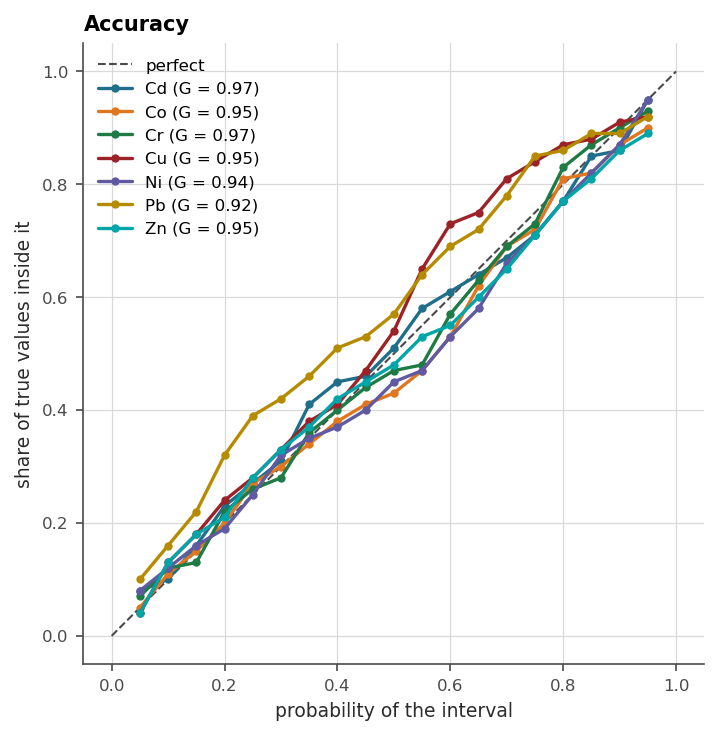
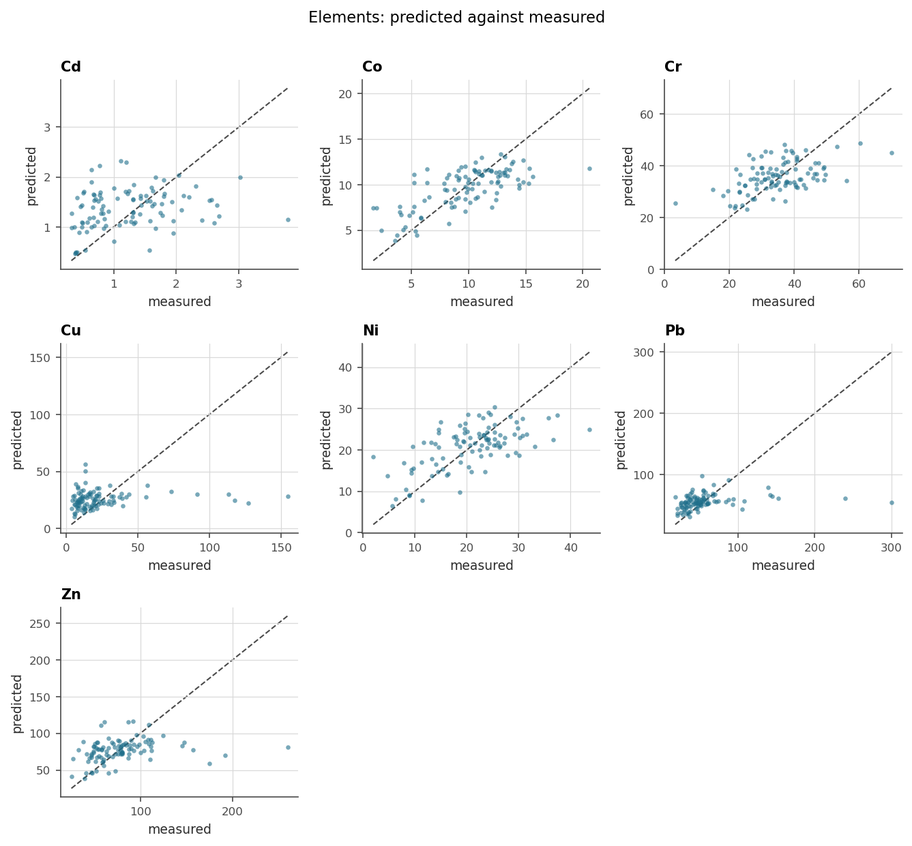

# 14. Reporting

The last mile: turning a validated model into things people look at. The
package draws every figure twice, deliberately. A matplotlib family
(`Explorer`) is for print, and a plotly family (`Interactive`) carries the
same figures under the same names for looking at, plus a dashboard that
links them. The arithmetic behind both lives in one backend-free module,
so the printed figure and the interactive one can never quietly disagree.

The running example is Jura's seven elements, scored where reporting
should score them: on the held-out validation set.

```python
import os
import tempfile

import geoml
import numpy as np

os.makedirs("figures", exist_ok=True)
geoml.set_seed(1234)

jura_train, jura_validation = geoml.datasets.jura()
n_el = len(jura_train.get("Elements").labels)

root = geoml.latent.BasicInput(
    inducing_points=jura_train,
    transform=geoml.transform.Isotropic(1.0))

gp = geoml.latent.BasicGP(
    root,
    size=n_el,
    kernel=geoml.kernels.Spherical())

# one likelihood serves any number of columns; the warping's size is what
# says how many there are
warping = geoml.warping.ChainedWarping(
    geoml.warping.Softplus(n_el),
    geoml.warping.ZScore(n_el))

model = geoml.models.VGPNetwork(
    jura_train, "Elements",
    geoml.likelihood.Gaussian(warping),
    gp,
    options=geoml.models.GPOptions(verbose=False))

model.train_full(max_iter=300)

model.predict(jura_validation, n_sim=30, include_noise=True)
```

## 14.1 The honest figures

Chapter 13 made the point, and here it pays off. `jura_validation` was
never trained on, so every comparison figure on it means what it shows.
That includes `accuracy`, which asks the model for *measurement*
intervals, and may be used here without the caveat it carries on training
data.

```python
explore = geoml.plots.Explorer(jura_validation, continuous="Elements",
                               model=model)

figure = explore.accuracy()
figure.savefig("figures/14-accuracy.png", dpi=150, bbox_inches="tight")

figure = explore.prediction_scatter()
figure.savefig("figures/14-scatter.png", dpi=150, bbox_inches="tight")
```





The accuracy plot is the geostatistician's calibration check, and chapter
13 computes its number as `goodness`. The scatter is the figure everyone
asks for first and over-reads: its spread mixes model error with assay
noise, which is exactly why the accuracy plot sits beside it.

## 14.2 The dashboard

The plotly twins compose into a single self-contained HTML page with their
selections linked, so clicking a population in the histogram lights up the
same samples on the map. It renders in a notebook through an iframe and
travels as one file that needs nothing installed.

```python
board = geoml.plots.Interactive(
    jura_validation,
    continuous="Elements",
    categorical="Rock").dashboard(figures=("histogram", "scene"),
                                  plotlyjs="cdn")

path = board.write_html(
    os.path.join(tempfile.mkdtemp(), "jura-dashboard.html"))

print("dashboard written:", os.path.getsize(path) > 10000)
```

`plotlyjs="cdn"` keeps the file small by loading the plotting library from
the web. The default embeds it instead, for a page that works with no
connection at all, which is the right choice for a report that must open
in ten years.

## 14.3 What goes in a report, and where it came from

A defensible reporting set, chapter by chapter, all from one model:

| item | source |
|---|---|
| block model with grades and their doubt | chapters 8, 12 (`as_data_frame`, `as_pyvista`, `to_zarr`) |
| grade–tonnage with uncertainty | chapter 8's figure |
| domain boundaries and grade shells as meshes | chapter 12 (`get_contour`, DXF) |
| validation scores and calibration | chapter 13 (`cross_validate`, `conformalize`) |
| calibration and scatter figures | this chapter, on held-out data |
| the model document itself | `print(model)` and `to_dot()` (chapters 5, 11) |

The last row deserves more custom than it gets. The model's own `repr`,
with every parameter, every bound and what was fixed, is the audit trail a
competent person signs against, and it costs one line to include.

> **In the code.** `plots/explorer.py` and `plots/interactive.py` hold the
> twin families, `plots/prepare.py` the shared arithmetic, and
> `plots/dashboard.py` the linked page. `as_pyvista(...)` on any container
> is the door to external 3D viewers.

## Further reading

Chapter 15 assembles the full sequence, data to dashboard, on Walker Lake,
and chapter 17 does it with the geometry of a real deposit in the way.
