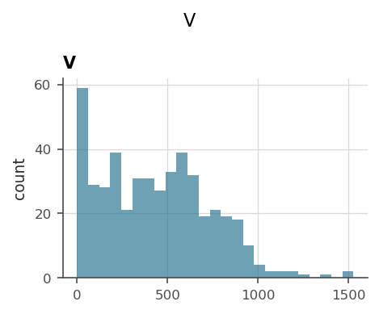
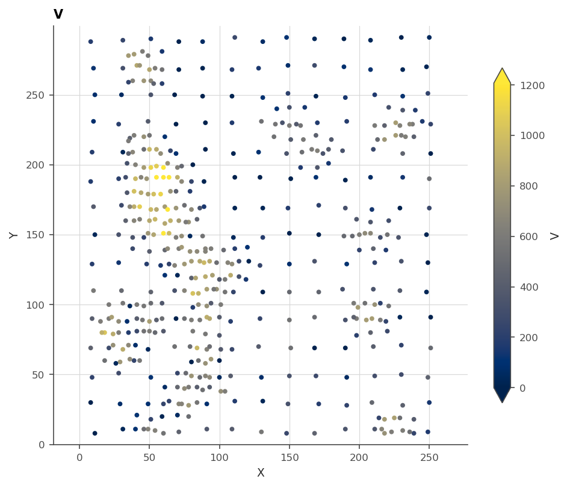
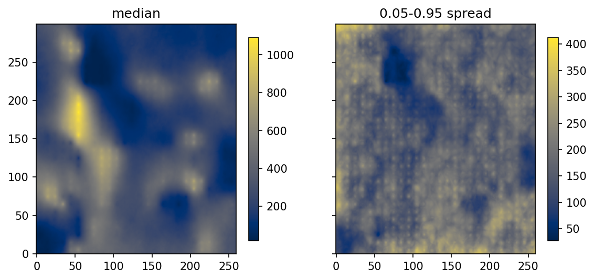

# 15. Case study: Walker Lake

The classic 2D benchmark, end to end: look at the data, build and train a
model, validate it where it never looked, calibrate what the validation
finds, and map the result. Everything here was introduced in Parts I and
II, and this chapter is the sequence, with the reasoning said at each
step. Walker Lake's `V` is a positive, strongly skewed variable on 470
irregularly sampled locations, with a 78 000-node prediction grid: small
enough to run in minutes, awkward enough to be honest.

## 15.1 Look first

```python
import os

import geoml
import numpy as np

os.makedirs("figures", exist_ok=True)
geoml.set_seed(1234)

walker, walker_grid = geoml.datasets.walker()
print(walker.tree())

explore = geoml.plots.Explorer(walker, continuous="V")

explore.histogram().savefig("figures/15-histogram.png", dpi=150,
                            bbox_inches="tight")
explore.scene(clip=[0, 0.99]).savefig("figures/15-samples.png", dpi=150,
                                      bbox_inches="tight")
```





Two decisions fall straight out of looking. The long right tail wants a
positivity warping with a trainable spline behind it (chapter 4), and the
banded, uneven sampling means a random validation split would lie
(chapter 13).

## 15.2 Build and train

The model of chapter 11, assembled one named piece at a time: inducing
points on a 10-unit lattice over the prediction grid, cut into experts; a
spherical kernel; and the chain that keeps a grade positive.

```python
experts = geoml.data.inducing.grid_experts(walker_grid, 10.0, block=8)

root = geoml.latent.BasicInput(
    experts,
    transform=geoml.transform.Isotropic(50))

gp = geoml.latent.BasicGP(
    root,
    size=1,
    kernel=geoml.kernels.Spherical())

warping = geoml.warping.ChainedWarping(
    geoml.warping.Scale(1),
    geoml.warping.Softplus(1),
    geoml.warping.ZScore(1),
    geoml.warping.Spline(1, knots_per_arm=4))

model = geoml.models.VGPNetwork(
    walker, "V",
    geoml.likelihood.Gaussian(warping),
    gp,
    options=geoml.models.GPOptions(verbose=False))

model.train_full(max_iter=500)

figure = geoml.plots.Explorer(walker, continuous="V",
                              model=model).training_curve()
figure.savefig("figures/15-training.png", dpi=150, bbox_inches="tight")
```


## 15.3 Validate, then calibrate

Folds built against the actual prediction grid, scored on measurements,
and the interval claim checked. This is chapter 13 compressed to its
practice.

```python
w, target, achieved = walker.spatial_k_fold(walker_grid, k=5, seed=0)

oof, scores = geoml.models.cross_validate(model, iterations=200,
                                          n_sim=20)

print(scores[scores["fold"] == "all"][
    ["rmse", "mae", "bias", "crps", "goodness"]].round(2))

calibration = geoml.models.conformalize(oof, "V")
print("cut a '90%' interval at:", round(calibration.nominal(0.9), 3))

figure = geoml.plots.Explorer(oof, continuous="V").variogram(n_lags=12)
figure.savefig("figures/15-variogram.png", dpi=150, bbox_inches="tight")
```


Three things to sign against. The pooled scores are the map's expected
error, measured where the model never looked. The calibration verdict says
how wide a "90%" interval really has to be cut. And the variogram fan is
the spatial check the other two cannot make: the realizations track the
data's curve across the range, so the model walks like the ground rather
than merely landing in the right place on average. That matters to a
resource estimate, because a field fitted too smooth understates how often
neighbouring blocks differ.

Both sides of that figure are corrected before they meet, and chapter 13
explains why at length. The fan is raised by the fitted noise, since the
realizations are of the ground and the assays are not, and the pairs are
declustered, since Walker Lake's samples sit preferentially in high-value
ground and a raw experimental variogram would describe the drilling rather
than the deposit.

## 15.4 Map it

```python
import matplotlib.pyplot as plt

model.predict(walker_grid, n_sim=50, include_noise=True)
walker_grid.get("V").reset_quantiles([0.05, 0.5, 0.95])

median = walker_grid.get("V/quantiles/0.5").as_image()
spread = walker_grid.get("V/quantiles/0.95").as_image() \
    - walker_grid.get("V/quantiles/0.05").as_image()

figure, axes = plt.subplots(1, 2, figsize=(9, 4.2), sharey=True)

for ax, image, title in zip(axes, [median, spread],
                            ["median", "0.05-0.95 spread"]):
    drawn = ax.imshow(image, origin="lower", cmap="cividis")
    figure.colorbar(drawn, ax=ax, shrink=0.8)
    ax.set_title(title)

figure.savefig("figures/15-maps.png", dpi=150, bbox_inches="tight")

print("lowest mapped value:",
      round(float(np.min(walker_grid.values("V/quantiles/0.05"))), 1))
```



The two maps travel together on purpose. A median map alone answers "what
is it", while the spread beside it answers "where would drilling teach the
most", and the validated, calibrated intervals behind them are what make
either worth acting on. The lowest mapped value is above zero, which
chapter 2's model could not promise and this warping chain can.

## What this study did not need

No experimental variogram was fitted, because the model estimated its own
and §15.3 *checked* it. No normal-score tables were built, because the
warping is the transform and it is trained. No search neighbourhood was
tuned, because the inducing points are the sparsity. The whole study is
one seed, six objects and five figures, which is the point of the package
and the reason this chapter fits on a few pages.
