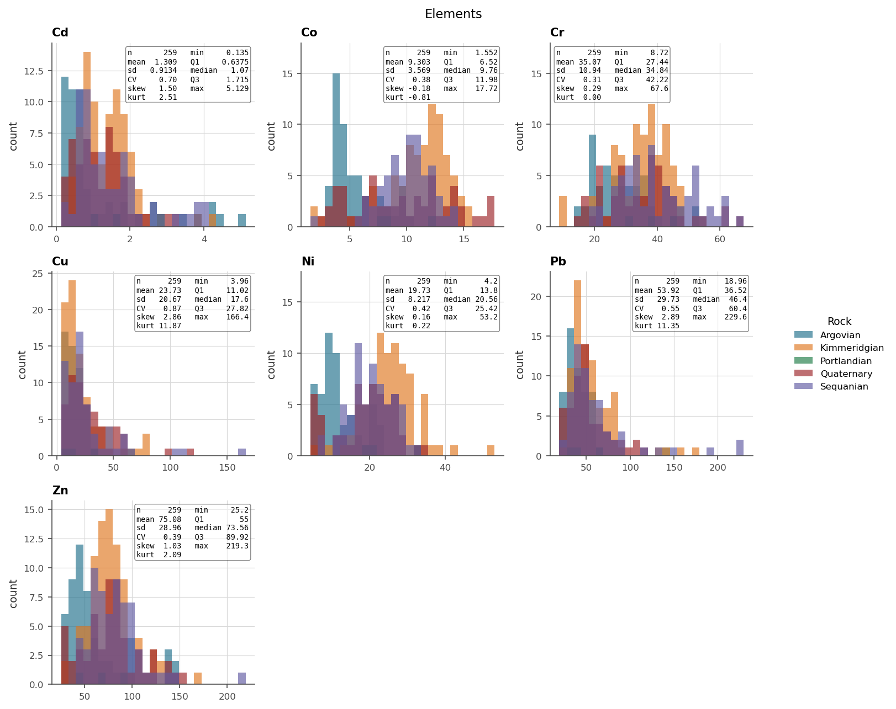
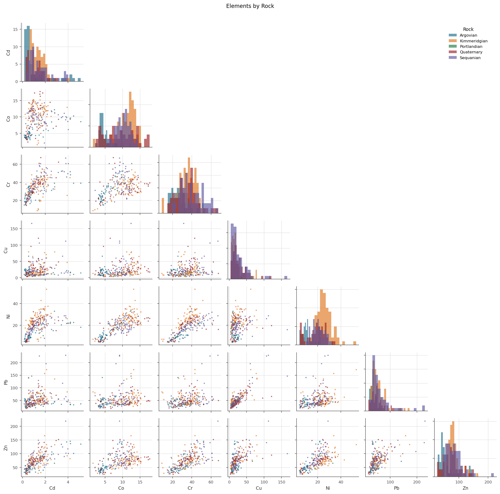
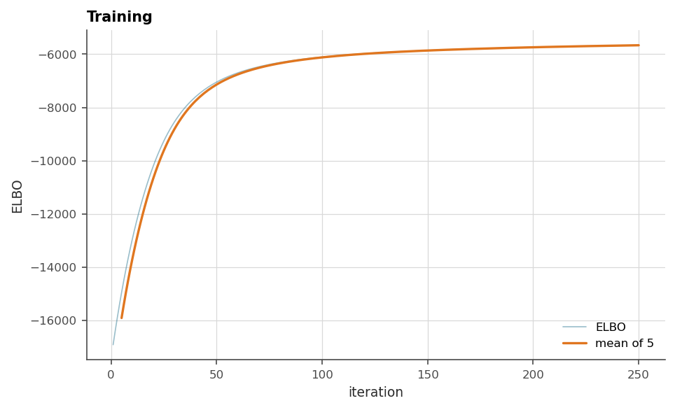
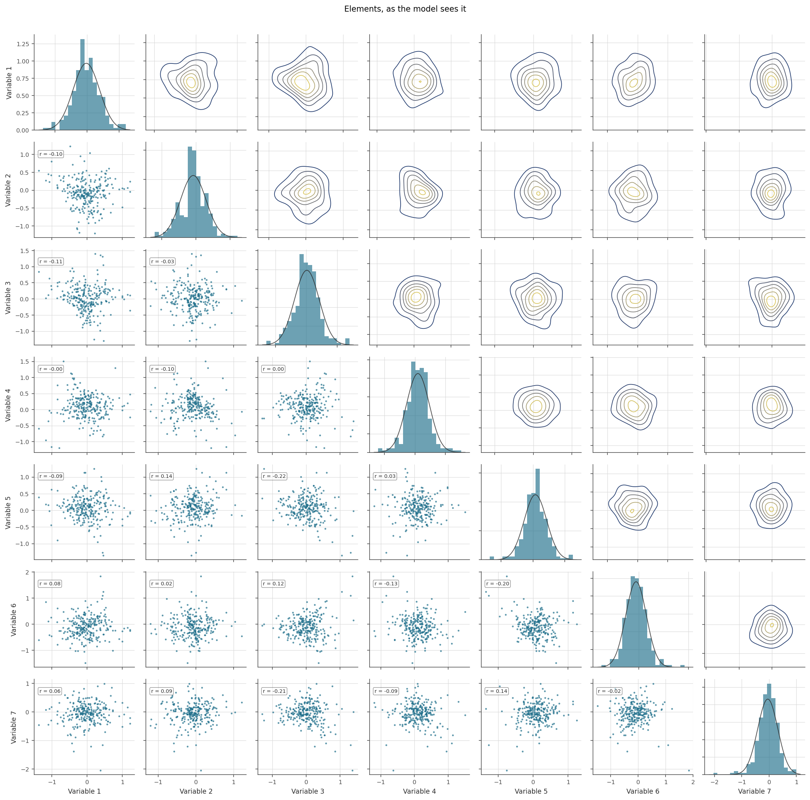
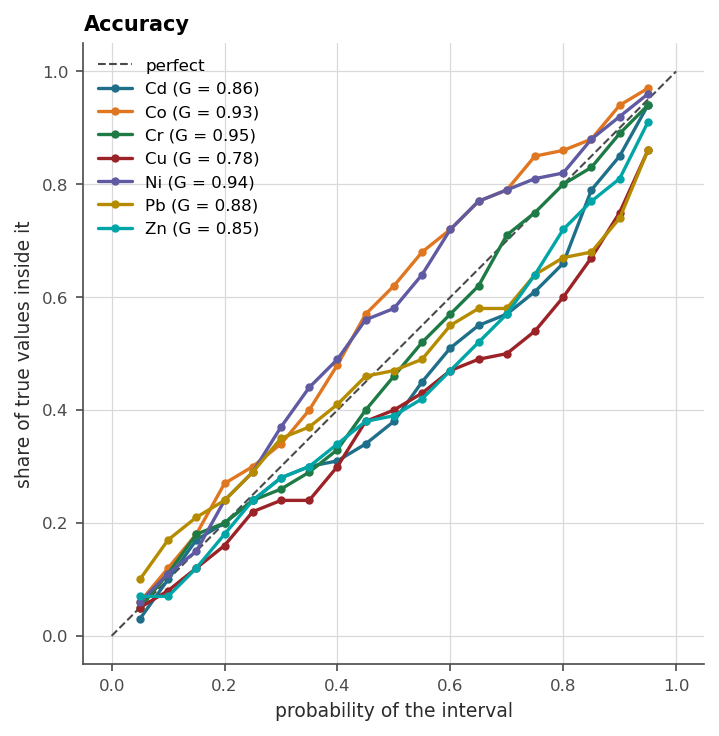
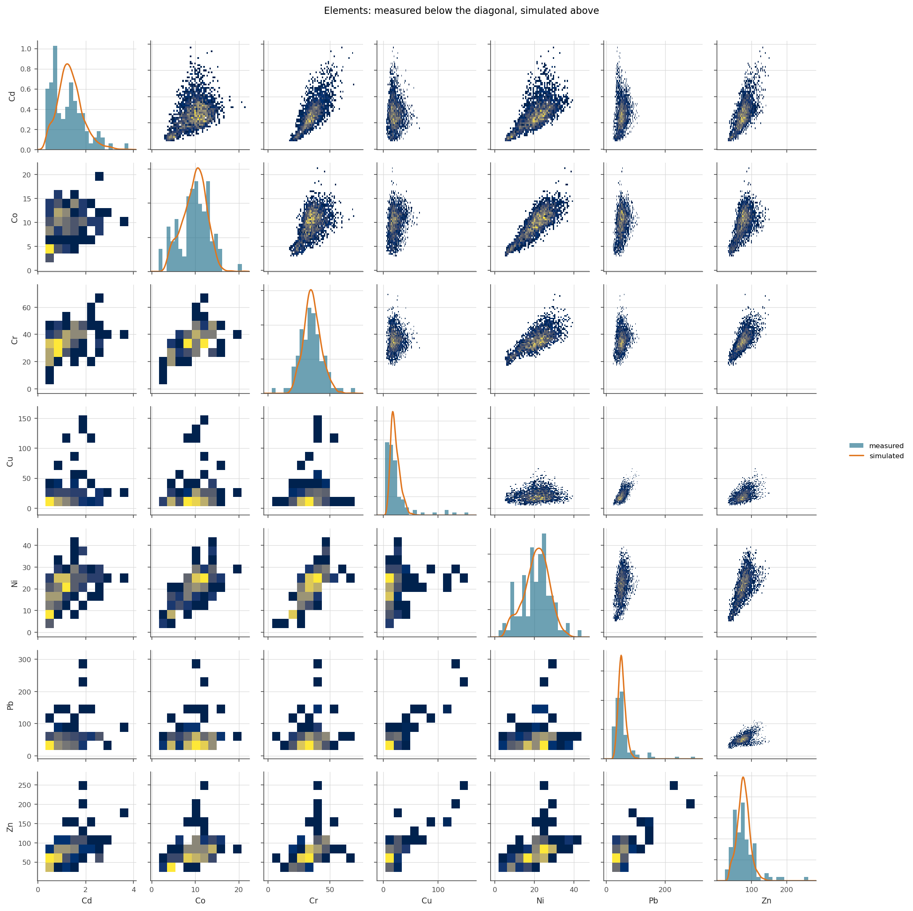
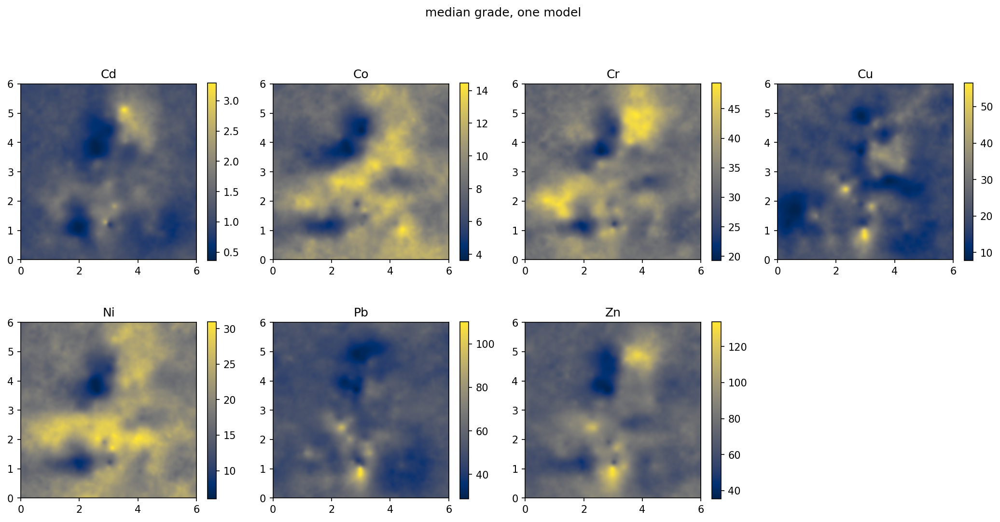
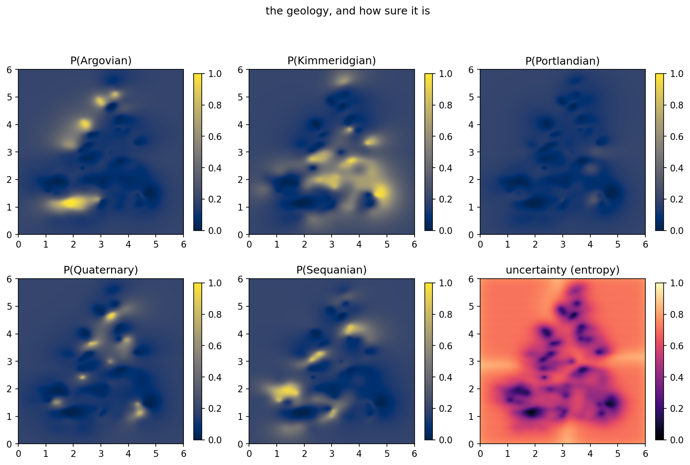

# 16. Case study: Jura

Seven correlated heavy metals and a rock type, 259 training sites and 100
held out. This is the classic multivariate testbed, and the case study for
one model carrying **two variables of different kinds at once**, where one
of them is allowed to inform the other. The payoff of sharing a model is
not elegance. The rock type and the metals share spatial structure, and a
network that lets them say so predicts both better than two models that
cannot.

## 16.1 Look, jointly

```python
import os

import geoml
import matplotlib.pyplot as plt

os.makedirs("figures", exist_ok=True)
geoml.set_seed(1234)

jura_train, jura_validation = geoml.datasets.jura()
print(jura_train.tree())

elements = list(jura_train.get("Elements").labels)
rocks = list(jura_train.get("Rock").labels)
print(elements)
print(rocks)
```

```python
explore = geoml.plots.Explorer(jura_train, continuous="Elements",
                               categorical="Rock")

explore.histogram().savefig("figures/16-histograms.png", dpi=150,
                            bbox_inches="tight")
explore.pairs(kind="scatter").savefig("figures/16-pairs.png", dpi=150,
                                      bbox_inches="tight")
```





Two arguments for the joint model, both visible before any modelling. The
histograms grouped by rock type show several metals shifting distribution
with the geology, so the rock type is informative about the grades. The
pair plot shows the metals are strongly correlated with each other and
skewed, which is what the warping chain below has to deal with.

## 16.2 A non-stationary network, and how one variable reaches another

The network is the whole point of this chapter, so it is built in three
pieces with the reason for each said out loud.

The inducing points are the data's own locations plus a regular backbone,
so that the model is anchored where the samples are and still has something
to say over the empty parts of the map. They are then divided into experts
(chapter 3).

```python
grid = geoml.data.Grid2D(start=[0, 0], end=[6, 6], n=[201, 201])

backbone = geoml.data.inducing.combine(
    jura_train,
    geoml.data.Grid2D(start=[0, 0], end=[6, 6], n=[21, 21]))

inducing = geoml.data.inducing.experts(backbone, 4)

print(backbone.n_data, "inducing points, split into", len(inducing),
      "experts holding", sum(part.n_data for part in inducing),
      "between them")

root = geoml.latent.BasicInput(
    inducing_points=inducing,
    transform=geoml.transform.Isotropic(0.05))
```

The two counts differ because the experts *overlap*: each borrows a share
of its neighbours' points so that they blend rather than butt up against
each other (chapter 3). The 700 is the number of distinct locations; the
larger number is what the four sets hold between them. The blending is good
but not perfect. A faint trace of the expert boundaries is visible in the
uncertainty map at the end of this chapter, which is the most sensitive
column to look for it in.

**The geology is modelled in a space the model is allowed to bend.** An
inner GP of two columns moves the coordinates, `GPWalk` integrates that
movement over a few steps, and the rock-type fields are modelled on the
result. A stationary kernel in the moved space is a non-stationary one in
the real space, which is chapter 5's argument applied to a contact rather
than to a grade.

```python
displacement = geoml.latent.BasicGP(
    root, size=2, kernel=geoml.kernels.Gaussian())

walked = geoml.latent.GPWalk(displacement, n_steps=5)

rock_gp = geoml.latent.BasicGP(
    walked, size=len(rocks), kernel=geoml.kernels.Matern32())
```

**The geology reaches the grades as a trend that is added to them.** A
`Linear` node takes the five rock fields to seven columns, one per element,
and `LinearCombination` adds that to a GP of the metals' own. The
`unit_norm=False` is the important argument: it lets the mixing weights
shrink towards zero, so the model can decide that the geology says nothing
about a particular element rather than being forced to use it.

```python
trend = geoml.latent.Linear(
    rock_gp, size=len(elements), unit_norm=False)

metal_gp = geoml.latent.BasicGP(
    root, size=len(elements), kernel=geoml.kernels.Spherical())

# the model's output: rock indicators first, then the metals, matching the
# order of the variables and likelihoods below
network = geoml.latent.Concatenate(
    rock_gp,
    geoml.latent.LinearCombination(trend, metal_gp))
```

That is a different move from making the rock fields a *parent* of the
metal GP. Both are available, and the difference is how strong a claim they
make. A parent would have the metals read the geology through the
uncertainty propagation of a deep GP, committing to the grades living in
the geology's warped space. The additive trend says something weaker and
more defensible: whatever the rock type contributes, add it, and let the
weights decide how much.

The likelihood is where the metals' awkwardness is handled. `Laplace` has
heavier tails than a Gaussian, which is what the extreme values in this
dataset want, and the chain does the rest: `Log` for non-negativity,
`RobustPCA` to decorrelate the seven columns, `Spline` for what asymmetry
is left, and `ZScore` to hand the field something standardized.

```python
warping = geoml.warping.ChainedWarping(
    geoml.warping.Log(len(elements)),
    geoml.warping.RobustPCA(len(elements), len(elements)),
    geoml.warping.Spline(len(elements), knots_per_arm=5),
    geoml.warping.ZScore(len(elements)))

model = geoml.models.VGPNetwork(
    data=jura_train,
    variables=["Rock", "Elements"],
    likelihoods=[
        geoml.likelihood.CategoricalGaussianIndicator(len(rocks)),
        geoml.likelihood.Laplace(warping=warping)],
    latent_network=network,
    options=geoml.models.GPOptions(prediction_batch_size=1000,
                                   jitter=1e-6, verbose=False))

model.train_full(250)

figure = geoml.plots.Explorer(jura_train, continuous="Elements",
                              model=model).training_curve()
figure.savefig("figures/16-training.png", dpi=150, bbox_inches="tight")
```



## 16.3 How many inducing points, and how we know

The inducing set above is larger than the score needs, and rather than
assert that, here it is measured. Everything below is the same network, the
same warping and the same 250 iterations, with only the inducing points
changing, scored on the 100 sites nobody trained on. The metals' error is
divided by each element's own standard deviation and averaged, so 1.0 would
mean "no better than quoting the average grade".

| inducing points | training | metals, rmse / sd | goodness | rock accuracy |
|---|---|---|---|---|
| 259, the data alone | 56 s | 0.90 | 0.47 | 0.70 |
| 380, data + an 11 × 11 backbone | 69 s | 0.91 | 0.50 | 0.66 |
| **700, data + 21 × 21, four experts** | **204 s** | **0.91** | **0.52** | **0.70** |
| 1220, data + 31 × 31, four experts | 308 s | 0.91 | 0.50 | 0.63 |

**The metals' score does not move.** Nearly five times the inducing
points, five and a half times the training, and the held-out error is flat
to the second decimal; the rock's accuracy wobbles around 0.7 and is
lowest at the largest set.

Chapter 3 ran the same sweep on the plainest possible version of this
dataset — a stationary model, a Gaussian likelihood, no walked input — and
carried it to 2401 inducing points: the same flatness up to around the
data count, then a slow worsening while the intervals keep narrowing. Two
configurations this far apart agreeing is worth more than either alone:
**what capacity buys is resolution rather than accuracy at the sampled
sites**, and what it costs is a slow narrowing of the model's own
intervals, which a validation table shows long before it becomes a
problem. The goodness column above is computed from the container's stored
simulations, so like every such number it describes the *ground* rather
than an assay and reads low; chapter 13 does it the honest way, and
`cross_validate` does it that way for you.

So why keep the larger set? Because the table is measured at *sampled*
locations, and it cannot speak for the ground between them. A regular
backbone of inducing points exists for the map, and a validation set drawn
from the same campaign is structurally unable to notice it. That is a limit
of the metric rather than a verdict on the backbone, and it is the kind of
blind spot worth naming: a number that does not move is not always a number
that has looked.

Where the table *is* decisive is cost. If you want this model and not its
map, the data's own locations give the same score in a quarter of the time.

## 16.4 Did the warping do its job?

The model assumes its latent columns are independent standard normals. The
warping is what has to deliver that, and it is easier to look at than to
test.

```python
figure = geoml.plots.Explorer(jura_train, continuous="Elements",
                              model=model).transformed_pairs(upper="density")
figure.savefig("figures/16-transformed.png", dpi=150, bbox_inches="tight")
```



Down the diagonal, each column should sit under the standard normal drawn
over it. Off the diagonal, the clouds should be round and the correlations
near zero. The columns are numbered rather than named, because after a
rotation a column is a mixture of the measured elements rather than any one
of them. Leaning clouds here are dependence the model is about to assume
away, which is the argument for keeping `RobustPCA` in the chain.

## 16.5 Score on the samples nobody trained on

Jura ships with a genuine held-out set, so scoring is one prediction away,
and the `accuracy` figure is honest here without any cross-validation
(chapter 13's caveat does not bite on a true validation set).

```python
model.predict(jura_validation, n_sim=30, include_noise=True)

metal_scores = jura_validation.get("Elements").compute_metrics()
print(metal_scores.loc[["Root Mean Square Error (prediction)",
                        "CRPS (simulations)",
                        "Goodness (simulations)"]].round(3))

rock_scores = jura_validation.get("Rock").compute_metrics()
print(rock_scores.round(3))
```

```python
explore = geoml.plots.Explorer(jura_validation, continuous="Elements",
                               model=model)

explore.accuracy().savefig("figures/16-accuracy.png", dpi=150,
                           bbox_inches="tight")
explore.simulation_pairs().savefig("figures/16-simulation-pairs.png",
                                   dpi=150, bbox_inches="tight")
```





`compute_metrics` reports per component: seven columns for the metals, and
balanced accuracy and friends per rock class. That is the table a report
wants, and the accuracy figure is its calibration column drawn.

One column in the rock table is worth reading before it is mistaken for a
bug. Portlandian comes back with a balanced accuracy of 0.5 and a Jaccard
of zero, which is what those statistics say about a class the model never
predicts anywhere. It is the rarest formation in the training set, the
other four outvote it at every location, and no amount of fitting will
change that without telling the model the class matters more than its
frequency suggests. A rare domain that matters is a modelling decision, not
a scoring accident.

`simulation_pairs` asks the question a per-variable score cannot. The
realizations should reproduce not only each metal's own histogram but the
*shape of the cloud* every pair of them makes. A model that gets the
margins right and the joint wrong will estimate any function of two metals
badly, and a smelter payment schedule is exactly such a function.

## 16.6 Map everything

One prediction over the grid fills both variables at once.

```python
model.predict(grid, n_sim=30, include_noise=True)
grid.get("Elements").reset_quantiles([0.5])

figure, axes = plt.subplots(2, 4, figsize=(14, 7.4))

for ax, element in zip(axes.ravel(), elements):
    # a quantile of thirty realizations is grainy; `sigma` smooths what the
    # figure shows without touching anything stored
    image = grid.get("Elements/%s/quantiles/0.5" % element).as_image(sigma=1)
    drawn = ax.imshow(image, origin="lower", cmap="cividis",
                      extent=(0, 6, 0, 6))
    figure.colorbar(drawn, ax=ax, shrink=0.8)
    ax.set_title(element)

axes.ravel()[-1].set_visible(False)
figure.suptitle("median grade, one model")
figure.tight_layout(rect=(0, 0, 1, 0.94), h_pad=2.5)
figure.savefig("figures/16-element-maps.png", dpi=150,
               bbox_inches="tight")
```



```python
figure, axes = plt.subplots(2, 3, figsize=(11, 7.4))

for ax, rock in zip(axes.ravel(), rocks):
    image = grid.get("Rock/%s/probability" % rock).as_image()
    drawn = ax.imshow(image, origin="lower", cmap="cividis",
                      extent=(0, 6, 0, 6), vmin=0, vmax=1)
    figure.colorbar(drawn, ax=ax, shrink=0.8)
    ax.set_title("P(%s)" % rock)

last = axes.ravel()[-1]
drawn = last.imshow(grid.get("Rock/uncertainty").as_image(),
                    origin="lower", cmap="magma",
                    extent=(0, 6, 0, 6), vmin=0, vmax=1)
figure.colorbar(drawn, ax=last, shrink=0.8)
last.set_title("uncertainty (entropy)")

figure.suptitle("the geology, and how sure it is")
figure.tight_layout(rect=(0, 0, 1, 0.94), h_pad=2.5)
figure.savefig("figures/16-rock-maps.png", dpi=150, bbox_inches="tight")
```



The grade maps and the geology maps came out of one model, and their
agreement is not a coincidence to check but a property of the
construction. The metal fields carry a trend read off the rock fields, so a
formation boundary is visible in the grades because the model was told it
might be, and the entropy map marks exactly the places where that reading
is least certain.

The `sigma=1` in the grade maps deserves a word, since it is the one place
this chapter touches a picture rather than a number. A quantile of thirty
realizations is a noisy estimate, and `as_image(sigma=...)` blurs what the
figure shows without altering anything the container holds. One pixel is a
light touch: it takes the harshest speckle off and leaves the grain, which
is the right amount, because that grain is not a rendering artefact. It is
the Monte Carlo error of thirty realizations, and a larger `sigma` would
make these maps look more certain than the model is.

That is the rule for the argument generally. It is a presentation choice,
fine for a map somebody looks at, and never to be applied to numbers being
scored. The maps above go through it and every score in §16.5 does not.
The uncertainty map is drawn unsmoothed for the same reason, which is also
why the faint cross of the expert boundaries is still visible in it.

## Further reading

Goovaerts (1997) built much of its multivariate chapter on this dataset,
and the 2022 regression paper and the 2025 deep-GP paper both use Jura in
the package's own idiom.

## References

Goovaerts, P. (1997). *Geostatistics for Natural Resources Evaluation*.
Oxford University Press.

Gonçalves, Í. G. *et al.* (2022). Learning spatial patterns with
variational Gaussian processes: regression. *Computers & Geosciences*.
<https://doi.org/10.1016/j.cageo.2022.105056>

Gonçalves, Í. G. *et al.* (2025). Uncertainty propagation in deep Gaussian
process networks. *Mathematical Geosciences*.
<https://doi.org/10.1007/s11004-025-10187-4>
