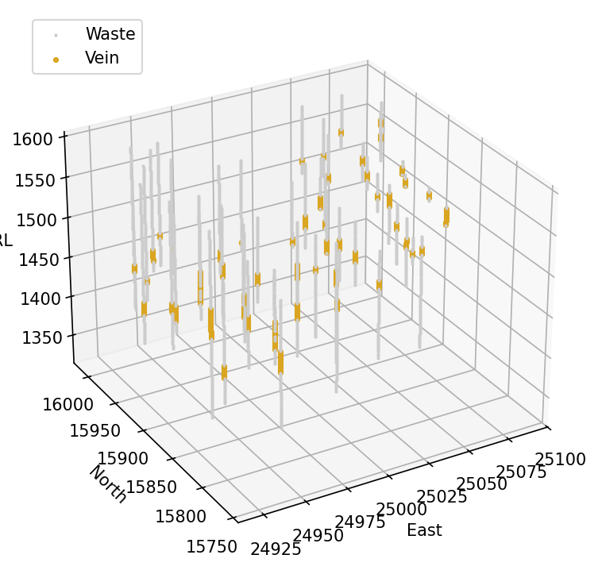
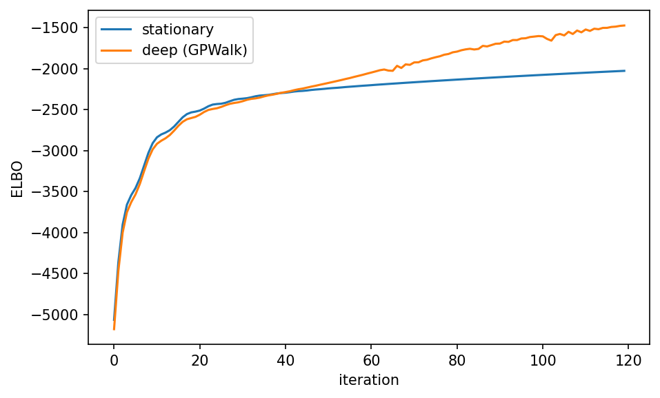
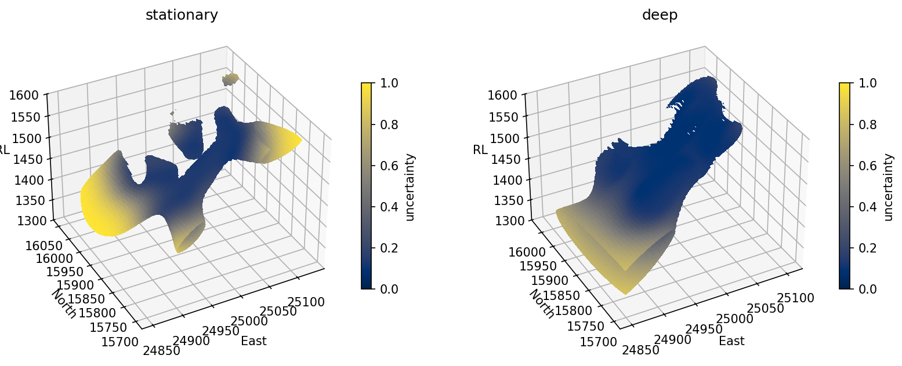

# 17. Case study: a folded quartz vein

<!-- requires-network -->

The last case study is the one the first two could not be: a real orebody
in three dimensions, logged in drillholes, where the deliverable is a
*surface* rather than a map. Fifty-three holes intersect a thin quartz
vein folded through the host rock. Two categories, `Vein` and `Waste`, and
one question: where is the contact, and how sure are we?

This is also the chapter where a stationary model is visibly not enough,
which makes it the natural home for the deep network of chapter 5. Both
models are built and both surfaces are drawn, so the cost and the gain are
on the same page.

The data is fetched from the public copies used by the tutorial notebooks,
about 20 kB in total, and cached beside the chapter, so only the first run
needs a connection.

## 17.1 The database

```python
import io
import os
import urllib.request

import numpy as np
import pandas as pd
import matplotlib.pyplot as plt

import geoml

os.makedirs("figures", exist_ok=True)
os.makedirs("data", exist_ok=True)
geoml.set_seed(1234)

BASE = "https://drive.google.com/uc?export=download&id="
SHEETS = {"vein-collar.csv": "1AT-Hp540CzBP6UFDt6X7MwNTgQ0NA8Gs",
          "vein-lito.csv": "1ktNiQmvsETtIlXu1fhHFW3jzHRFI0BvW"}

for name, key in SHEETS.items():
    local = os.path.join("data", name)
    if not os.path.exists(local):
        raw = urllib.request.urlopen(BASE + key, timeout=60).read()
        pd.read_excel(io.BytesIO(raw)).to_csv(local, index=False)

collar = pd.read_csv("data/vein-collar.csv")

# the log also carries per-interval coordinates; they are not variables,
# and geoML computes them from the collar and survey anyway (chapter 9)
lito = pd.read_csv("data/vein-lito.csv",
                   usecols=["HOLE", "FROM", "TO", "SIMPLE LITO"])

holes = geoml.data.DrillholeData(
    collar,
    hole="HOLE", x="EAST", y="NORTH", z="RL", length="TDEPTH")

holes.add_intervals("lito", lito,
                    hole="HOLE", fr="FROM", to="TO",
                    categorical=["SIMPLE LITO"])

print(holes)
```

Fifty-three vertical holes and about 5.6 km drilled: a small database by
any standard, and the point of the chapter is that the geometry, not the
sample count, is what makes it hard.

Note what the summary reports: **247 intervals from a file with 250
rows.** The three missing ones belong to a hole, `GL76`, that the
lithology log records and the collar file does not, so there is nowhere to
put them in space. `add_intervals` warns and drops them rather than
guessing a collar, which is the behaviour to want. A silent guess here
would place three intervals at a fabricated location, and every model
downstream would honour them. Real databases disagree with themselves at
the edges, and the useful thing a tool can do is say where. Pass
`on_error="raise"` to make it a hard stop instead, which is the right
setting in a pipeline that should never proceed on a partial database.

## 17.2 From logged intervals to contacts

Chapter 9's conversion applies, with one preparatory step. The log records
many touching intervals of the same rock, and the contacts are what carry
information about the surface. `merge_domains` collapses each run of one
category into a single interval, so that the conversion drops points along
genuine runs and puts a contact only where the rock actually changes.

```python
merged = holes.merge_domains(("lito", "SIMPLE LITO"))
holes.add_intervals("lito", merged)

# two conversions from the same logs, at two spacings
dense = holes.as_classification_input(("lito", "SIMPLE LITO"), length=2.0)
sparse = holes.as_classification_input(("lito", "SIMPLE LITO"), length=10.0)

print(dense.tree())
print(dense.n_data, "training points,",
      sparse.n_data, "inducing points")
print("contacts:", int(np.sum(dense.values("SIMPLE LITO/boundary"))))
```

The dense conversion is what the model is trained on, and the sparse one
is where the inducing points go. That is chapter 3's separation made
concrete: the inducing set summarizes the region, and there is no reason
for it to be as dense as the data.

```python
coordinates = np.asarray(dense.coordinates)
rock = dense.values("SIMPLE LITO/measurements_a")

figure = plt.figure(figsize=(7.5, 6))
axes = figure.add_subplot(projection="3d")

for name, colour, size in [("Waste", "0.8", 1), ("Vein", "goldenrod", 6)]:
    mask = rock == name
    axes.scatter(coordinates[mask, 0], coordinates[mask, 1],
                 coordinates[mask, 2], s=size, c=colour, label=name,
                 depthshade=False)

axes.legend(loc="upper left")
axes.set_xlabel("East")
axes.set_ylabel("North")
axes.set_zlabel("RL")
axes.view_init(elev=28, azim=-120)

figure.savefig("figures/17-vein-holes.png", dpi=150, bbox_inches="tight")
```



The vein intersections trace a surface that dips and rolls: a shape a
single anisotropy ellipsoid can approximate but not follow.

## 17.3 The stationary baseline

The model of chapter 6, in 3D. One latent field, turned into two category
indicators by a `Linear` node, with an ellipsoid initialized from a look
at the data and free to move during training. Both models in this chapter
share that construction, so it is worth naming once.

```python
def implicit_model(root_node, data, iterations=120):
    """A one-field implicit model on the given input node."""
    field = geoml.latent.BasicGP(root_node, size=1)
    indicators = geoml.latent.Linear(field, size=2)

    model = geoml.models.VGPNetwork(
        data, "SIMPLE LITO",
        geoml.likelihood.CategoricalGaussianIndicator(2),
        indicators,
        options=geoml.models.GPOptions(jitter=1e-6, verbose=False))

    model.set_learning_rate(2e-2)
    model.train_full(max_iter=iterations)
    return model


flat_input = geoml.latent.BasicInput(
    inducing_points=sparse,
    transform=geoml.transform.Anisotropy3D(
        100, 1.0, 0.5, azimuth=270, dip=45),
    center=True)

flat_model = implicit_model(flat_input, dense)
```

## 17.4 The deep model: moving the ground before modelling it

Chapter 5's argument, applied. Rather than asking one ellipsoid to
describe a folded surface, let a *vector field* move the coordinates and
model a stationary field in the moved space. `GPWalk` integrates the
movement in a few steps, and everything downstream is unchanged: the same
one-field implicit model, reading transformed coordinates.

```python
deep_input = geoml.latent.BasicInput(
    inducing_points=sparse,
    transform=geoml.transform.Anisotropy3D(
        100, 1.0, 0.5, azimuth=270, dip=45),
    center=True)

displacement = geoml.latent.BasicGP(deep_input, size=3)
walked = geoml.latent.GPWalk(displacement, n_steps=5)

deep_model = implicit_model(walked, dense)

figure, axes = plt.subplots(figsize=(7, 4.2))
axes.plot(flat_model.training_log, label="stationary")
axes.plot(deep_model.training_log, label="deep (GPWalk)")
axes.set_xlabel("iteration")
axes.set_ylabel("ELBO")
axes.legend()

figure.savefig("figures/17-elbo.png", dpi=150, bbox_inches="tight")
```



The deep model reaches a higher ELBO on the same data, so it fits a shape
the ellipsoid could not. Whether that is skill or memory is precisely the
question chapter 13 exists to answer, and the honest check is below.

## 17.5 The surfaces

The deliverable is the zero level set of the vein's indicator. Contour it
out of a grid, then predict *onto the resulting surface* so that every
triangle carries the model's uncertainty there. Both models get the same
treatment, on the same grid.

```python
grid = geoml.data.Grid3D(start=[24850, 15700, 1300],
                         end=[25150, 16050, 1600],
                         n=[61, 71, 61])

surfaces = {}

for name, trained in [("stationary", flat_model), ("deep", deep_model)]:
    trained.predict(grid)
    surface = grid.get(
        "SIMPLE LITO/Vein/indicator_predicted").get_contour(0.0)
    trained.predict(surface)
    surfaces[name] = surface
    print("%-11s %6d triangles, %8.0f m2"
          % (name, len(surface.triangles), surface.area))
```

The contour is taken at zero because the category indicators are log-odds.
The surface where `Vein` stops losing to `Waste` *is* the contact, and
chapter 6's `ind_skew` is the same quantity read as a cut-off. Predicting
onto the surface is the second call: a mesh is a spatial object like any
other, so it takes a prediction, and what it carries is the model's
uncertainty about the very boundary it draws.

```python
figure = plt.figure(figsize=(13, 5.6))

for position, name in enumerate(["stationary", "deep"], start=1):
    surface = surfaces[name]
    vertices = np.asarray(surface.coordinates)
    uncertainty = surface.values("SIMPLE LITO/uncertainty")

    axes = figure.add_subplot(1, 2, position, projection="3d")
    drawn = axes.plot_trisurf(
        vertices[:, 0], vertices[:, 1], vertices[:, 2],
        triangles=surface.triangles, cmap="cividis", linewidth=0,
        antialiased=False)

    # colour by uncertainty rather than by elevation, which is what
    # plot_trisurf would use if left to itself
    drawn.set_array(uncertainty[surface.triangles].mean(axis=1))
    drawn.set_clim(0.0, 1.0)

    figure.colorbar(drawn, ax=axes, shrink=0.55, label="uncertainty")
    axes.set_title(name)
    axes.set_xlabel("East")
    axes.set_ylabel("North")
    axes.set_zlabel("RL")
    axes.set_zlim(1300, 1600)
    axes.view_init(elev=34, azim=-118)

figure.savefig("figures/17-vein-surface.png", dpi=150,
               bbox_inches="tight")
```



The colour is the part a CAD-drawn wireframe cannot carry. Both surfaces
are dark where holes constrain them and pale where they do not, which is
the map of where the next hole is worth drilling.

The difference between the two is the fold. One ellipsoid has to describe
a surface whose attitude changes along strike, and it cannot: the
stationary answer breaks into pieces, loses the vein between hole fences,
and flares into high-uncertainty skirts at the edges of the grid. The
walked input lets the same kernel follow the roll, and the deep answer is
a single coherent sheet that stays with the intersections and only opens
up past the last hole. The uncertainty colouring is what makes the
comparison fair, because it distinguishes a surface the model is
committing to from one it is guessing at.

## 17.6 Did the fold help?

A surface that fits better is not automatically a better model. The
comparison that counts is on samples the model did not see, and with 53
holes the split that respects the geometry is by hole (chapter 13).

```python
flat_model.predict(dense)
flat_predicted = dense.values("SIMPLE LITO/predicted").copy()

deep_model.predict(dense)
deep_predicted = dense.values("SIMPLE LITO/predicted").copy()

interior = ~dense.values("SIMPLE LITO/boundary").astype(bool)
truth = dense.values("SIMPLE LITO/measurements_a")

for name, predicted in [("stationary", flat_predicted),
                        ("deep      ", deep_predicted)]:
    agree = np.mean(predicted[interior] == truth[interior])
    print("%s in-sample agreement: %.3f" % (name, agree))
```

These are in-sample numbers, printed with that label because the point of
chapter 13 is that in-sample numbers flatter every model and flatter the
flexible one most. A deep model has more ways to memorize 53 holes than a
stationary one, so the honest comparison runs `cross_validate` with the
folds cut on `HOLEID`, which every conversion in chapter 9 carried as
metadata precisely for this. At the iteration counts this chapter runs at,
the numbers above illustrate the machinery rather than settle the geology.

> **In the code.** `geoml.latent.GPWalk` is the SDE node, and
> `geoml.transform.Anisotropy3D` the ellipsoid it takes the burden off.
> `Attribute.get_contour(value)` builds the `Surface3D`, meshes take
> predictions like any container, and `Mesh3D.simplify`, `.smooth` and the
> booleans of chapter 12 apply to the result. `DrillholeData.merge_domains`
> collapses the runs the log records, and `as_classification_input` puts
> the contacts in at zero support.

## Further reading

The potential-field formulation is Lajaunie et al. (1997), geoML's
machine-learning reading of it is the 2017 paper, and the categorical
treatment used here is the 2023 one. The deep model and this dataset are
the subject of the 2025 paper, where the fold is examined properly rather
than at a manual's iteration counts.

## References

Gonçalves, Í. G. *et al.* (2017). A machine learning approach to the
potential-field method for implicit modeling of geological structures.
*Computers & Geosciences*.

Gonçalves, Í. G. *et al.* (2023). Variational Gaussian processes for
implicit geological modeling. *Computers & Geosciences*.
<https://linkinghub.elsevier.com/retrieve/pii/S0098300423000274>

Gonçalves, Í. G. *et al.* (2025). Uncertainty propagation in deep Gaussian
process networks. *Mathematical Geosciences*.
<https://doi.org/10.1007/s11004-025-10187-4>

Lajaunie, C., Courrioux, G., & Manuel, L. (1997). Foliation fields and 3D
cartography in geology: principles of a method based on potential
interpolation. *Mathematical Geology*, 29(4), 571–584.
